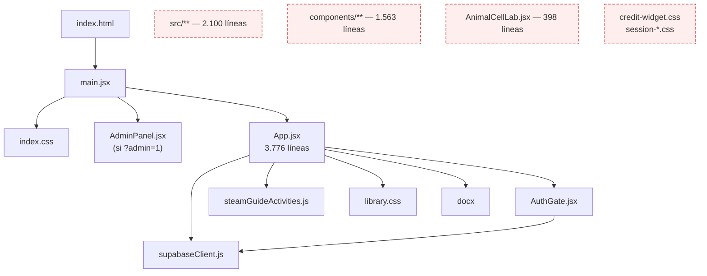
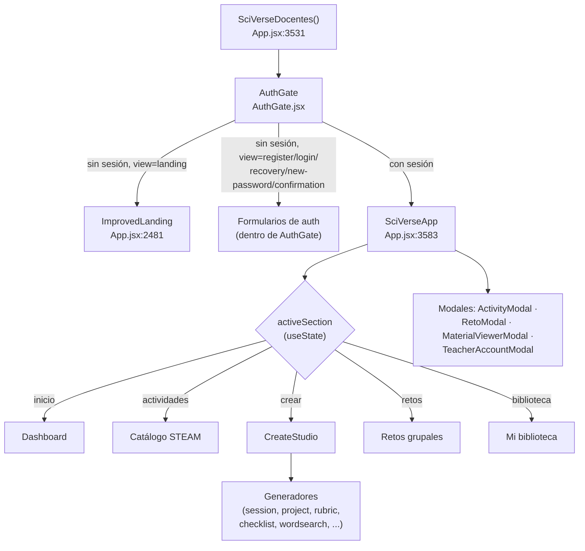
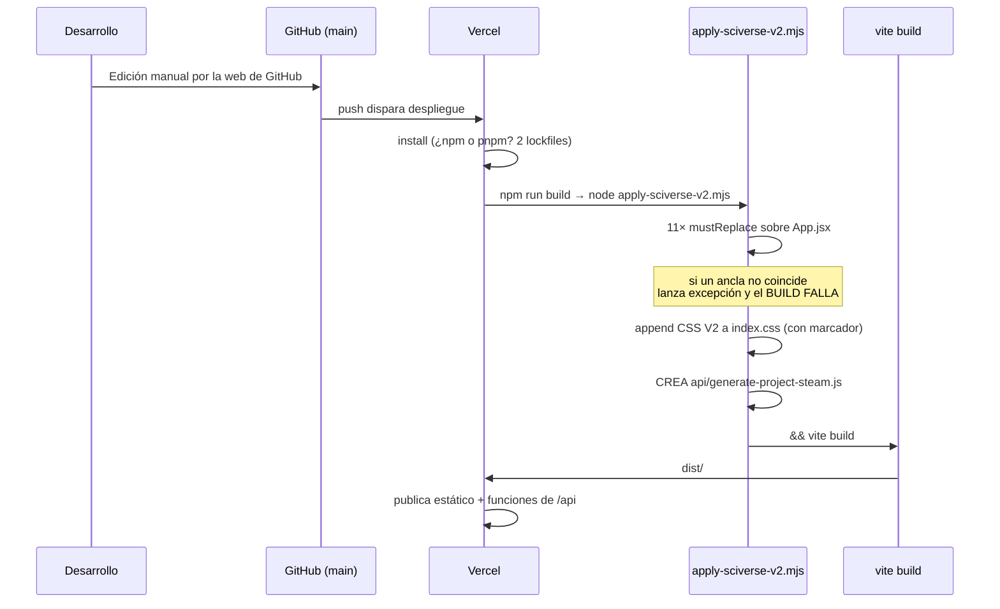
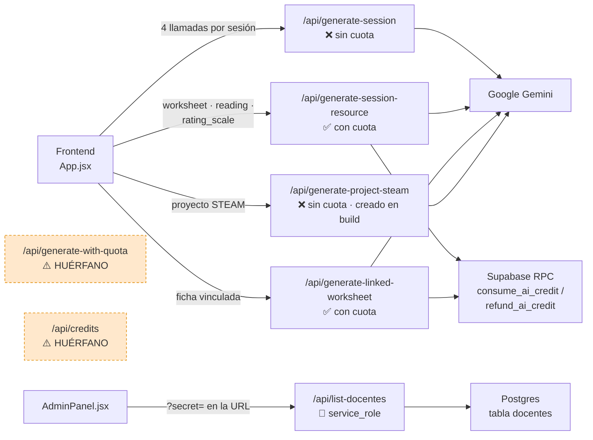
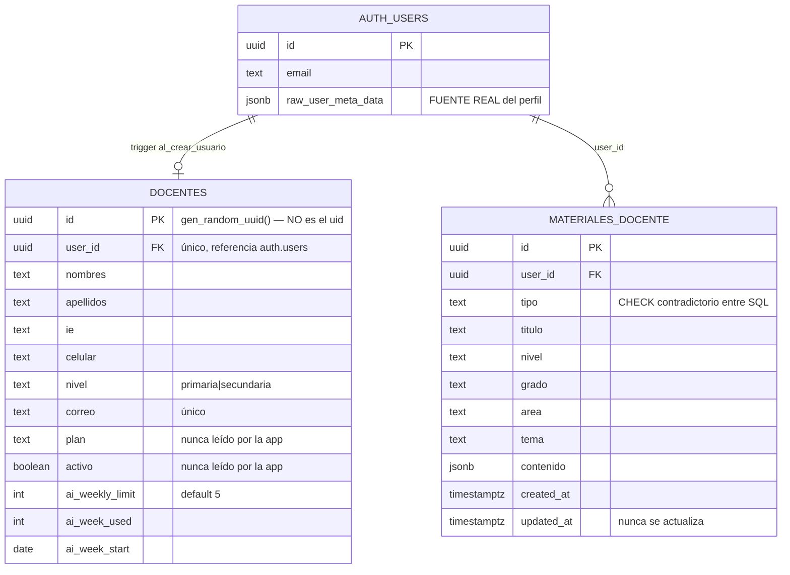
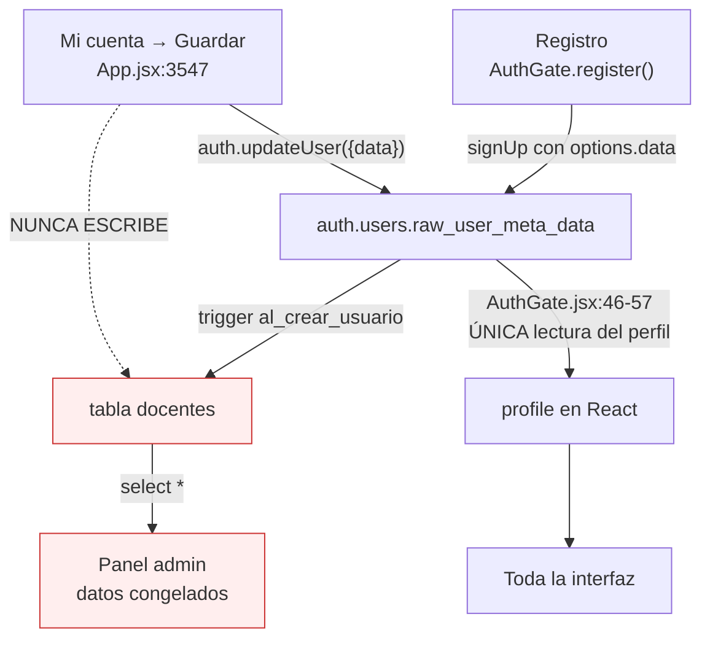
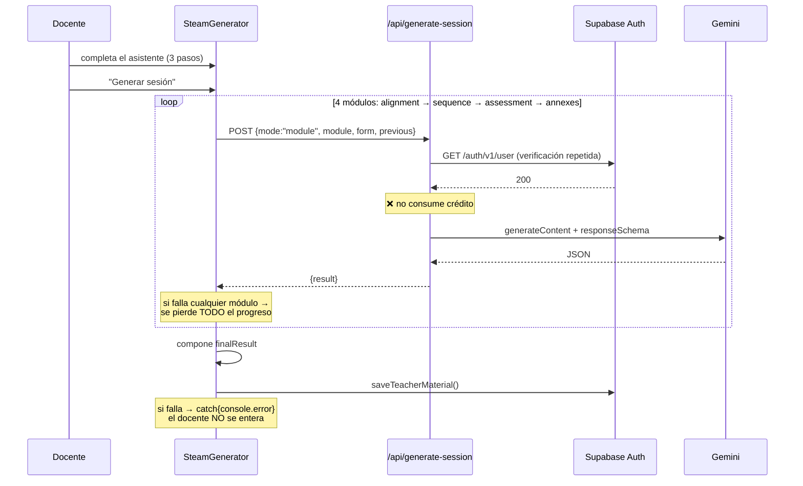
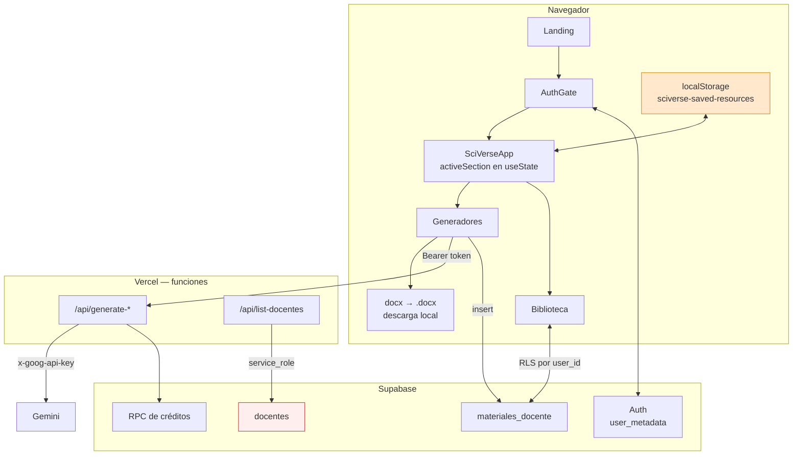

# 01 — Arquitectura actual

Estado del sistema tal como está en el commit `e49c68c`. Todo lo descrito aquí se verificó leyendo el código, no se asume.

---

## 1. Stack

| Capa | Tecnología | Versión declarada | Notas |
|---|---|---|---|
| UI | React | `^18.2.0` | Sin router, sin gestor de estado, sin librería de UI |
| Bundler | Vite | `^5.2.0` | `vite.config.js` es la configuración por defecto: solo el plugin de React |
| Estilos | Tailwind CSS + CSS plano | `^3.4.3` | Uso mixto; ver sección 6 |
| Iconos | lucide-react | `^0.383.0` | Importación nombrada, ~90 iconos |
| Documentos | docx | `^9.7.1` | Generación de `.docx` en el navegador |
| Auth + BD | @supabase/supabase-js | `^2.45.4` | Auth por email/contraseña, Postgres con RLS |
| IA | Google Gemini REST | — | `v1beta/models/{model}:generateContent`, sin SDK |
| Hosting | Vercel | — | Estático + funciones serverless en `/api` |

No hay TypeScript, ESLint, Prettier, Vitest, Jest, Playwright ni Husky. No hay `vercel.json`, `.editorconfig`, `.nvmrc`, `.gitattributes` ni workflows de CI.

---

## 2. Estructura de archivos

```
pruebatt/
├── index.html                     ← carga /main.jsx (RAÍZ, no src/)
├── main.jsx                       ← punto de entrada REAL
├── App.jsx                        ← 3.776 líneas / 277 KB — toda la app
├── AuthGate.jsx                   ← autenticación REAL (318 líneas)
├── AdminPanel.jsx                 ← panel admin (103 líneas)
├── AnimalCellLab.jsx              ← 398 líneas · MUERTO, nunca importado
├── supabaseClient.js              ← cliente Supabase
├── steamGuideActivities.js        ← 17 actividades STEAM (datos)
├── index.css                      ← 99 KB · Tailwind + ~330 colores literales
├── library.css                    ← 10 KB · importado por App.jsx
├── credit-widget.css              ← MUERTO · ningún archivo lo importa
├── session-next-flow.css          ← MUERTO (lo importa un componente muerto)
├── session-resources.css          ← MUERTO (lo importa un componente muerto)
├── apply-sciverse-v2.mjs          ← 89 KB · CODEMOD DE BUILD (ver sección 4)
│
├── api/                           ← funciones serverless de Vercel
│   ├── generate-session.js        ← generador principal · SIN cuota
│   ├── generate-session-resource.js ← recursos V2 · CON cuota
│   ├── generate-linked-worksheet.js ← ficha vinculada · CON cuota
│   ├── generate-with-quota.js     ← wrapper de cuota · HUÉRFANO
│   ├── credits.js                 ← estado de créditos · HUÉRFANO
│   ├── list-docentes.js           ← listado admin · service_role
│   └── (generate-project-steam.js)← NO EXISTE · lo crea el build
│
├── components/                    ← DIRECTORIO COMPLETO MUERTO (1.563 líneas)
│   ├── CreditsIndicator.jsx
│   ├── SessionNextFlow.jsx
│   └── SessionResourcesPanel.jsx
│
├── src/                           ← DIRECTORIO COMPLETO MUERTO (versión antigua)
│   ├── App.jsx  (1.897 líneas)
│   ├── AdminPanel.jsx  (idéntico al de la raíz)
│   ├── main.jsx · supabaseClient.js · index.css
│
├── public/mascot/                 ← kantu-material.png, kantu-session.png
│
├── *.sql                          ← 4 archivos, con contradicciones entre sí
├── *.zip                          ← 3 snapshots de versiones antiguas (223 KB)
├── *.txt                          ← 6 archivos de instrucciones manuales
├── package.json · package-fallback.json
└── package-lock.json + pnpm-lock.yaml + pnpm-workspace.yaml   ← 2 lockfiles
```

### Grafo de importación real

Solo estos archivos llegan al bundle:



**Nota clave:** `index.html:11` apunta a `/main.jsx` en la raíz. Todo `src/` es un fósil de una versión anterior. Es la fuente de confusión más común al abrir este repositorio.

---

## 3. Frontend

### 3.1 Jerarquía de componentes



### 3.2 Gestión de estado

No hay Redux, Zustand, Context ni React Query. Todo es `useState` local dentro de dos componentes gigantes:

- **`SciVerseApp`** declara **20 `useState`** (`App.jsx:3585-3602`): `heroGrade`, `gradeFilter`, `subjectFilter`, `selected`, `selectedReto`, `retoView`, `modalGrade`, `accountOpen`, `activeSection`, `teacherMaterials`, `materialsLoading`, `libraryTab`, `librarySearch`, `libraryType`, `libraryLevel`, `librarySort`, `selectedMaterial`, `savedResources`…
- Cada generador declara su propio `form`, `step`, `loading`, `error`, `result` — el mismo patrón repetido 9 veces sin abstracción compartida.

**Comunicación entre componentes por evento global del navegador.** `saveTeacherMaterial` (`App.jsx:125`) emite `window.dispatchEvent(new CustomEvent("sciverse:material-created"))` y `SciVerseApp` lo escucha (`App.jsx:3613`) para recargar la biblioteca. Es un bus de eventos improvisado que reemplaza a lo que debería ser estado elevado o una capa de datos.

### 3.3 Enrutamiento

**No existe.** La única lectura de la URL en toda la aplicación viva es:

```js
// main.jsx:7
const isAdmin = new URLSearchParams(window.location.search).get("admin") === "1";
```

Todo lo demás es estado en memoria. Consecuencias en `03-UX-AUDIT.md` §2.7.

### 3.4 Rendimiento

- `React.lazy` / `Suspense`: **0 usos**. Todo se carga en un bundle único.
- `useMemo` / `React.memo` / `useCallback` en listas: **0 / 0 / 1**.
- `ErrorBoundary`: **0**. Un error de render en cualquier generador deja la pantalla en blanco.
- `AbortController`: **0**. Las llamadas a Gemini (60-120 s) no se cancelan al navegar.

---

## 4. Proceso de build

Este es el aspecto más inusual de la arquitectura y merece su propio diagrama.



### Qué modifica el codemod

| # | Objetivo | Efecto |
|---|---|---|
| 1 | Iconos | Añade `Gamepad2, ListChecks, CalendarDays` al import de lucide |
| 2 | Generadores V2 | Inyecta `ProjectSteamGenerator`, `ResourceFromAI`, `ValuationScaleGenerator`, `LinkedWorksheetGenerator`, `LinkedReadingGenerator`, `LinkedRatingScaleGenerator`, `CompleteClassFlow`, `CompleteClassIntro`, `FlowChoiceCard` |
| 3 | `CreateStudio` | **Reemplazo total** por una versión con categorías |
| 4 | Estado | Añade `initialCreation` para abrir el estudio desde el dashboard |
| 5 | Dashboard | **Reemplazo total** por el "Home V2" |
| 6 / 6B | Cableado | Conecta dashboard ↔ estudio y el flujo Sesión→Instrumento→Material |
| 7 | CSS | Añade ~2 bloques grandes a `index.css` (idempotente por marcador) |
| 8 | API | **Crea `api/generate-project-steam.js`** desde una cadena de 101 líneas |

### Hechos verificados

Ejecutando el script sobre una copia aislada del blob de Git:

- **Primera pasada: correcta.** `App.jsx` pasa de 3.776 → 4.221 líneas; `index.css` de 268 → 339; se crea `api/generate-project-steam.js` (101 líneas).
- **Segunda pasada: falla.** `Error: No pude aplicar el cambio: iconos del dashboard`. No es idempotente.
- **En Windows falla siempre.** El árbol de trabajo local tiene CRLF (`core.autocrlf=true`, sin `.gitattributes`); las anclas del codemod usan LF. El blob de Git sí tiene LF, por eso Vercel (Linux) construye bien y el desarrollador local no puede construir nunca.

---

## 5. Backend — funciones serverless

Todas son funciones de Vercel con la firma `export default async function handler(req, res)`. No hay framework, middleware, validación por esquema ni capa compartida: cada archivo repite su propia lógica de auth y de errores.



Patrón de autenticación (repetido en cada archivo, con variantes):

```js
const token = req.headers.authorization?.replace(/^Bearer\s+/i, "");
const auth = await fetch(`${supabaseUrl}/auth/v1/user`, {
  headers: { apikey: supabaseKey, Authorization: `Bearer ${token}` }
});
if (!auth.ok) return res.status(401).json({ error: "Tu sesión venció." });
```

Esto implica **una petición HTTP extra a Supabase por cada llamada** — para una sesión completa son 4 verificaciones redundantes del mismo token. Detalle en `06-BACKEND-API-AUDIT.md`.

---

## 6. Estilos

Coexisten **cuatro sistemas** sin frontera clara:

| Sistema | Dónde | Volumen |
|---|---|---|
| Tailwind (utilidades) | `className="flex items-center gap-2 px-6"` | ~145 elementos |
| CSS plano con clases semánticas | `index.css`, `library.css` | 99 KB + 10 KB |
| Estilos en línea con el objeto `C` | `style={{ background: C.teal }}` | 167 ocurrencias |
| `<style>` embebido en componente | `App.jsx:3643` | 1 bloque con `@import` de fuentes |

**Tres paletas independientes y divergentes:**

| Token | `App.jsx` (`C`) | `AuthGate.jsx` (`COLORS`) | `AdminPanel.jsx` (`C_*`) |
|---|---|---|---|
| teal | `#3EC6C0` | `#35B9AD` | `#3EC6C0` |
| text | `#0F2E2C` | `#102A2E` | `#0F2E2C` |
| muted | `#5B7876` | `#64777A` | `#5B7876` |
| line | `rgba(15,61,58,0.14)` | `#D7E9E7` | `rgba(15,61,58,0.14)` |

Además `index.css` contiene **331 valores de color literales distintos** y solo **6 propiedades personalizadas CSS**, sin bloque `:root`. Detalle en `04-UI-DESIGN-SYSTEM-AUDIT.md`.

---

## 7. Supabase

### Esquema



### Flujo de datos del perfil — la divergencia



La tabla `docentes` se escribe una vez (por el trigger) y **nunca más se actualiza**. La aplicación lee el perfil solo de `user_metadata`. El panel admin lee solo de `docentes`. Los dos divergen desde la primera edición de perfil.

### RLS y políticas

| Tabla | RLS | SELECT | INSERT | UPDATE | DELETE |
|---|---|---|---|---|---|
| `docentes` | activo | `auth.uid() = user_id` | **ninguna** | `auth.uid() = user_id` | **ninguna** |
| `materiales_docente` | activo | `auth.uid() = user_id` | `auth.uid() = user_id` | `auth.uid() = user_id` | `auth.uid() = user_id` |

`docentes` no tiene política de INSERT — el trigger es `SECURITY DEFINER`, así que funciona; pero cualquier inserción desde el cliente falla. Es correcto por diseño, aunque el `src/App.jsx` muerto todavía intenta hacerlo.

### Funciones RPC

`get_ai_credit_status()`, `consume_ai_credit()`, `refund_ai_credit()` — todas `SECURITY DEFINER`, `search_path = public`, con `REVOKE ... FROM public` y `GRANT EXECUTE ... TO authenticated`. Bien construidas. `consume_ai_credit` usa `FOR UPDATE` para serializar el consumo. La semana se calcula con `date_trunc('week', timezone('America/Lima', now()))`.

---

## 8. Integración con Gemini



Modelo por defecto: `process.env.GEMINI_MAIN_MODEL || "gemini-3.6-flash"` — idéntico en los cuatro endpoints. `gemini-3.6-flash` no corresponde a ningún identificador publicado de Gemini; si la variable de entorno no está definida en Vercel, toda generación devolvería error del proveedor. Ver `09-AI-GEMINI-AUDIT.md` §2.

---

## 9. Despliegue en Vercel

- Sin `vercel.json`: se usa la detección automática (framework Vite, `dist/` como salida, `/api/*.js` como funciones Node).
- **Dos lockfiles** (`package-lock.json` y `pnpm-lock.yaml`) más `pnpm-workspace.yaml`. Vercel prioriza `pnpm-lock.yaml` cuando existe; el `package-lock.json` queda ignorado y ambos pueden desincronizarse.
- Runtime de las funciones: no fijado (`nodejs` por defecto de la plataforma). Sin `maxDuration` declarada — riesgo real para el generador de sesiones, que encadena 4 llamadas largas.
- Sin `regions`: las funciones corren en la región por defecto, lejos de los usuarios peruanos.
- Como no hay router en el cliente, no se necesitan rewrites de SPA. Esa es la única ventaja de no tener enrutamiento.

### Variables de entorno declaradas en `.env.example`

| Variable | Ámbito | Uso real |
|---|---|---|
| `GEMINI_API_KEY` | servidor | Los 4 endpoints de generación |
| `GEMINI_MAIN_MODEL` | servidor | **No documentada en `.env.example`** pero leída por los 4 endpoints |
| `VITE_SUPABASE_URL` | cliente + servidor | `supabaseClient.js` y endpoints |
| `VITE_SUPABASE_ANON_KEY` | cliente | Clave pública |
| `VITE_SUPABASE_PUBLISHABLE_KEY` | cliente | Alternativa moderna; **no está en `.env.example`** |
| `SUPABASE_URL` | servidor | Respaldo en varios endpoints |
| `SUPABASE_SERVICE_ROLE_KEY` | servidor | Solo `list-docentes.js` |
| `ADMIN_SECRET` | servidor | Solo `list-docentes.js` |

`.env.example` está desactualizado: le faltan `GEMINI_MAIN_MODEL` y `VITE_SUPABASE_PUBLISHABLE_KEY`, ambas leídas por el código.

---

## 10. Flujo de datos completo



Dos detalles del diagrama que importan:

- **`localStorage` guarda "Guardados" (favoritos)** con la clave `sciverse-saved-resources` (`App.jsx:3602`). No se sincroniza con Supabase: cambiar de dispositivo o limpiar el navegador borra los favoritos sin aviso.
- **La tabla `docentes` (en rojo) es un extremo muerto**: recibe una escritura del trigger y solo la lee el panel admin.

---

## 11. Dependencias

### Producción (5)

| Paquete | Declarado | Estado |
|---|---|---|
| `react` / `react-dom` | `^18.2.0` | React 19 disponible; migrar no es urgente |
| `@supabase/supabase-js` | `^2.45.4` | Rango `^2` — recibe menores automáticamente |
| `docx` | `^9.7.1` | Uso intensivo y correcto |
| `lucide-react` | `^0.383.0` | Versión de mediados de 2024; import nombrado |

### Desarrollo (5)

`@vitejs/plugin-react`, `autoprefixer`, `postcss`, `tailwindcss`, `vite`.

### Observaciones

- **Ninguna dependencia innecesaria.** Las cinco de producción se usan de verdad. Esto es positivo.
- **Faltan las herramientas básicas de calidad**: sin linter, sin formateador, sin framework de pruebas.
- `tailwind.config.js` tiene `content: ["./index.html", "./*.{js,jsx}", "./src/**/*.{js,jsx}"]` — **no incluye `./components/**`**. Si algún día se reviven esos componentes, sus clases de Tailwind se purgarán del CSS y quedarán sin estilo.
- `package-fallback.json` es una copia de `package.json` con `"build": "vite build"` (sin codemod). Es el plan de emergencia documentado en los `.txt`.

---

## 12. Resumen de la arquitectura en una frase

Una SPA monolítica de un solo archivo, sin enrutamiento ni capa de datos, cuyo código fuente se reescribe a sí mismo durante el build, con el perfil de usuario duplicado en dos almacenes que nunca se sincronizan y un sistema de control de costos correctamente implementado pero desconectado de la ruta que más gasta.
