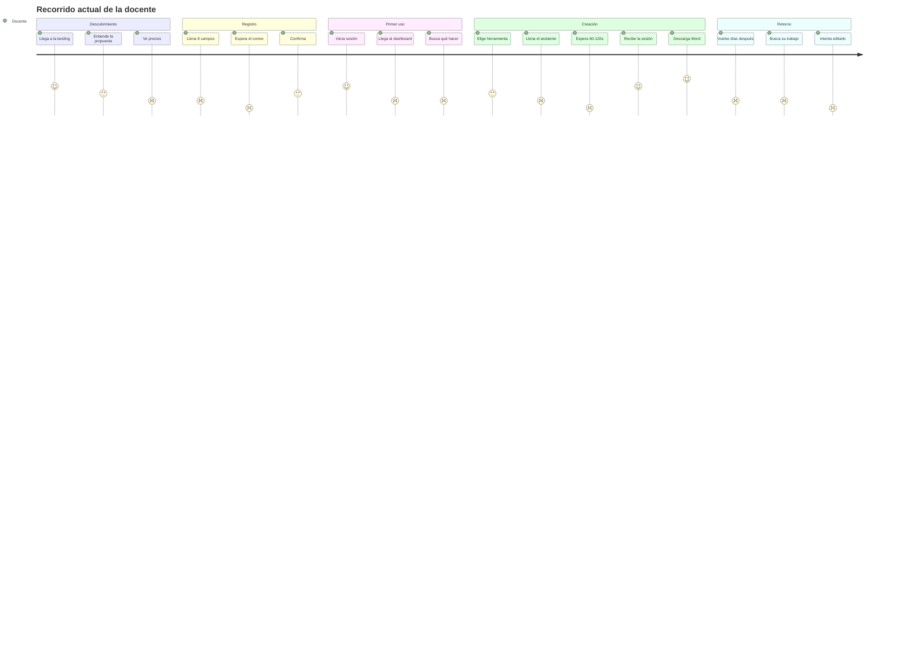

# 03 — Auditoría UX

> ⚠️ **Una afirmación de este documento es incorrecta.** Lo que se dice aquí sobre `onChoosePlan` (que elegir un plan de pago llevaría al registro) es **falso**: `PlansModal` ya abre WhatsApp correctamente. El resto del documento se mantiene. Detalle en [`25-AUDIT-CORRECTIONS.md`](25-AUDIT-CORRECTIONS.md) §C-2.


Evaluada desde la perspectiva de una docente real: tiempo escaso, conexión irregular, trabajo entre clases, y la necesidad de entregar documentos a dirección con formato oficial.

Cada hallazgo indica **qué pasa · dónde · por qué importa · impacto en la docente · propuesta · prioridad · esfuerzo**.

---

## Recorrido completo evaluado



Los dos puntos más bajos —**esperar sin retroalimentación** y **no poder editar lo creado**— son los que más erosionan la retención.

---

## 1. Landing → Registro

### 1.1 Los precios están escondidos tras un modal

**Qué pasa.** Los planes solo se ven abriendo `PlansModal` desde el nav o el pie (`App.jsx:2601`). No hay sección de precios en la página.

**Por qué importa.** El precio es la segunda pregunta de cualquier docente después de "¿qué hace?". Obligar a un clic extra para verlo aumenta el abandono, y como el contenido está en un modal montado bajo demanda, **los buscadores no lo indexan**: se pierde tráfico de búsquedas como "precio plataforma sesiones CNEB".

**Propuesta.** Sección `#planes` visible en la página, entre las preguntas frecuentes y la llamada final. Tres columnas: Gratuito · Mensual · Institucional (nueva, "consultar"). Mantener el modal solo como atajo desde el nav.

**Prioridad P1 · Esfuerzo S · Depende de:** resolver antes la contradicción de precios (1.2).

### 1.2 Los precios se contradicen en tres lugares

**Qué pasa.**

| Fuente | Dice |
|---|---|
| `PLANS` (`App.jsx:2427`) | Mensual **S/20**; gratuito "5 actividades + 5 instrumentos + 5 materiales semanales" |
| Banner del dashboard (`App.jsx:3700`) | "Actualiza tu plan **desde S/10**" |
| `TeacherAccountModal` (`App.jsx:3572`) | "Generaciones con IA **0 / 1**" |
| `supabase-freemium.sql` | `ai_weekly_limit` **= 5**, un único cupo compartido |

**Por qué importa.** Cuatro cifras distintas para lo mismo. Una docente que se registre esperando 15 creaciones semanales encontrará que se le agotan a la quinta. Eso es una promesa incumplida y motivo directo de reclamo.

**Impacto.** Pérdida de confianza en el momento de mayor intención de compra.

**Propuesta.** Fuente única en `src/config/plans.js` **(PROPUESTO — todavía no existe)**, importada por landing, modal de planes, dashboard y Mi cuenta. Alinear el texto comercial con lo que la base realmente concede: "5 creaciones con IA por semana", contadas de forma uniforme.

**Prioridad P0 · Esfuerzo S**

### 1.3 Elegir un plan de pago lleva al registro, no al pago

**Qué pasa.** `ImprovedLanding` define `choosePlan` con la lógica correcta de WhatsApp (`App.jsx:2505`) pero **nunca la usa**: pasa `onChoosePlan={onRegister}` al modal (`:2601`). `PlansModal` tiene su propio `handleChoosePlan` funcional, que queda anulado.

**Por qué importa.** La docente pulsa "Elegir plan mensual" esperando instrucciones de pago y aterriza en un formulario de registro sin explicación. Se pierde la conversión en el punto exacto de intención.

**Propuesta.** Pasar `onChoosePlan={choosePlan}` y borrar la duplicación. A medio plazo, sustituir el flujo de WhatsApp por una pantalla de checkout con instrucciones de Yape/Plin y carga de comprobante.

**Prioridad P0 · Esfuerzo XS**

### 1.4 El registro pide 8 campos de golpe

**Qué pasa.** `AuthGate.jsx:222-250` presenta en una pantalla: nombres, apellidos, institución, celular, nivel, correo, contraseña, confirmar contraseña, más el checkbox de términos.

**Por qué importa.** Cada campo adicional reduce la conversión. Institución y celular no son necesarios para empezar a usar el producto: son datos comerciales, no funcionales.

**Propuesta.** Dos pasos con progreso visible:

- **Paso 1 — Acceso (30 s):** correo, contraseña, nivel (primaria/secundaria). El nivel sí es funcional: filtra todo el contenido desde el primer segundo.
- **Paso 2 — Tu contexto (opcional, omitible):** nombres, apellidos, institución, región, áreas que enseña, grados.

Los datos del paso 2 pueden completarse después desde el onboarding o desde Mi cuenta. Ver `06-` para el análisis campo a campo.

**Prioridad P1 · Esfuerzo M**

### 1.5 Los enlaces de términos no son enlaces

**Qué pasa.** El checkbox dice "Acepto los términos y condiciones y la política de privacidad" como **texto plano** (`AuthGate.jsx:249`). `LegalModal` existe y funciona, pero solo desde la landing.

**Por qué importa.** Exigir aceptación de un documento sin darlo a leer es débil legalmente y erosiona la confianza.

**Propuesta.** Convertir ambas menciones en botones que abran `LegalModal` sin salir del formulario ni perder lo escrito.

**Prioridad P1 · Esfuerzo XS**

### 1.6 Sin medidor de fortaleza ni mostrar/ocultar contraseña

**Qué pasa.** Solo se valida `length >= 8` (`AuthGate.jsx:85`). Sin indicador visual, sin botón de ojo.

**Por qué importa.** En móvil, escribir una contraseña a ciegas dos veces es una de las causas más frecuentes de abandono del registro.

**Propuesta.** Botón mostrar/ocultar en ambos campos y barra de fortaleza de tres niveles con texto orientativo.

**Prioridad P2 · Esfuerzo S**

---

## 2. Confirmación → Login → Onboarding

### 2.1 La pantalla de confirmación es un callejón sin salida

**Qué pasa.** Tras registrarse, `view = "confirmation"` (`AuthGate.jsx:215-221`) muestra "Revisa tu correo" y un único botón, "Ya confirmé mi cuenta". **No hay forma de reenviar el correo.**

**Por qué importa.** Los correos de Supabase van a spam con frecuencia, y más aún con dominios institucionales peruanos. Si no llega, la docente no tiene ninguna acción disponible: ni reenviar, ni corregir el correo, ni contactar soporte. Se pierde la cuenta y el usuario.

**Impacto.** Es una fuga de conversión invisible: nadie se queja, simplemente no vuelven.

**Propuesta.**

1. Botón "Reenviar correo" con cuenta atrás de 60 s, usando `supabase.auth.resend({ type: 'signup' })`.
2. Mostrar el correo escrito con opción "¿Te equivocaste? Corregir".
3. Aviso explícito: "Revisa también tu carpeta de spam o correo no deseado".
4. Enlace de contacto a WhatsApp de soporte como último recurso.

**Prioridad P0 · Esfuerzo S**

### 2.2 No existe onboarding

**Qué pasa.** Tras el primer login, la docente cae directamente en el dashboard. Sin bienvenida, sin recorrido guiado, sin primer objetivo.

**Por qué importa.** El dashboard de producción (`apply-sciverse-v2.mjs` §5) muestra cuatro categorías equivalentes y un banner. Una docente que entra por primera vez no sabe por dónde empezar ni qué esperar. El "momento de valor" —tener una sesión descargada en Word— queda a varios clics sin señalizar.

**Propuesta.** Onboarding de tres pantallas la primera vez, omitible:

1. **"¿Qué enseñas?"** — confirmar nivel, elegir grados y áreas. Alimenta el perfil y precarga todos los formularios posteriores.
2. **"Así funciona"** — una animación de 15 s: describe tu clase → Kantu la genera → descárgala en Word.
3. **"Crea tu primera sesión"** — llevar directamente al generador con el formulario ya prellenado con los datos del paso 1.

Guardar `onboarding_completed` en el perfil. Objetivo medible: llevar a la docente a su primer `.docx` descargado en menos de 5 minutos desde el registro.

**Prioridad P0 · Esfuerzo L**

### 2.3 La elección primaria/secundaria no rinde lo que promete

**Qué pasa.** El nivel se elige en el registro y se guarda en metadata. `preferredGrade` (`App.jsx:3584`) lo usa como valor inicial de los generadores y del filtro de actividades.

**Por qué importa.** Está bien planteado, pero se queda a medias: no filtra retos, no ordena el catálogo por relevancia, no adapta los ejemplos ni los textos. Una docente de secundaria ve exactamente la misma interfaz que una de primaria salvo por un valor por defecto en un desplegable.

**Propuesta.** Que el nivel sea una dimensión real del producto: catálogo ordenado por relevancia al nivel y grado, ejemplos y textos de ayuda distintos, y recomendaciones ("docentes de 5.º de primaria en Ciencia y Tecnología suelen empezar por…").

**Prioridad P2 · Esfuerzo M**

---

## 3. Dashboard

### 3.1 El dashboard de producción no permite retomar trabajo

**Qué pasa.** El codemod sustituye el dashboard por uno que contiene: título, banner "Crear clase completa", cuatro categorías y una tarjeta de ayuda. **Eliminó las estadísticas y el panel de materiales recientes** que sí existen en la versión del repositorio (`App.jsx:3694-3699`).

**Por qué importa.** El dashboard es la primera pantalla en cada visita. En su forma actual solo responde "¿qué puedo crear?" y nunca "¿en qué estaba trabajando?". Para una docente que vuelve el martes a terminar lo del lunes, esto obliga a: Biblioteca → buscar entre tarjetas → abrir → descubrir que no se puede editar.

**Impacto.** Es el mayor obstáculo a la retención semanal. Un producto que no recuerda tu trabajo no se convierte en hábito.

**Propuesta — Home docente.** Sustituir la retícula plana por una jerarquía con tres niveles claros:

```
┌─────────────────────────────────────────────────────────┐
│ Hola, María 👋            Martes 3 de septiembre        │
│ 3 creaciones esta semana · te quedan 2 de 5 con IA      │
├─────────────────────────────────────────────────────────┤
│ CONTINUAR DONDE LO DEJASTE                              │
│ ┌────────────────────────────────────────────────────┐  │
│ │ 📄 Sesión: Los ecosistemas del Perú                │  │
│ │    4.º primaria · Ciencia y Tecnología · ayer      │  │
│ │    [Abrir]  [Descargar Word]  [Crear instrumento]  │  │
│ └────────────────────────────────────────────────────┘  │
├─────────────────────────────────────────────────────────┤
│ ACCIÓN PRINCIPAL                                        │
│ ┌────────────────────────────────────────────────────┐  │
│ │ ✨ Crear clase completa                            │  │
│ │    Sesión + instrumento + material en un recorrido │  │
│ │                                    [Empezar →]     │  │
│ └────────────────────────────────────────────────────┘  │
├─────────────────────────────────────────────────────────┤
│ CREAR ALGO PUNTUAL     (secundario, menor peso visual)  │
│ [Ficha] [Instrumento] [Juego] [Proyecto]                │
├─────────────────────────────────────────────────────────┤
│ TUS ÚLTIMOS MATERIALES              [Ver biblioteca →]  │
│ · Rúbrica: Ecosistemas       3 sep   [↓]                │
│ · Sesión: Fracciones         1 sep   [↓]                │
├─────────────────────────────────────────────────────────┤
│ NOVEDADES        📅 Capacitación en vivo · 12 sep       │
└─────────────────────────────────────────────────────────┘
```

Diferencias clave respecto al actual: existe *continuar*, hay **una** acción principal en vez de cuatro equivalentes, el consumo de IA es visible, y los materiales recientes se pueden descargar sin navegar.

**Prioridad P0 · Esfuerzo L**

### 3.2 Dos estadísticas muestran el mismo número

**Qué pasa.** En la versión del repositorio, "Creaciones realizadas" y "Mis materiales" son ambas `teacherMaterials.length` (`App.jsx:3695`).

**Por qué importa.** Dos tarjetas que ocupan la mitad del ancho para decir lo mismo. Ruido visual que además delata falta de cuidado.

**Propuesta.** Cuatro métricas distintas y útiles: creaciones **esta semana** · créditos IA restantes · materiales totales · descargas realizadas.

**Prioridad P2 · Esfuerzo S**

### 3.3 El botón "Pregúntale a Kantu" no lleva a ninguna parte

**Qué pasa.** En el dashboard de producción, ese botón ejecuta `openCreate(null)`, que no abre ninguna herramienta.

**Por qué importa.** Es la tarjeta con el tono más acogedor de toda la interfaz, y no hace nada. Una docente que la pulsa aprende que la interfaz no es fiable.

**Propuesta.** O se retira, o se convierte en lo que sugiere: un panel de ayuda contextual con preguntas frecuentes y acceso a soporte por WhatsApp.

**Prioridad P1 · Esfuerzo S**

---

## 4. Descubrimiento de herramientas

### 4.1 La función principal no está en el menú de creación

**Qué pasa.** El `CreateStudio` de producción no incluye "Sesión de aprendizaje" ni "Clase completa" en su catálogo (Fichas, Juegos, Instrumentos, Planificación). Ambas solo se alcanzan desde el dashboard mediante `initialCreation`.

**Por qué importa.** La sesión de aprendizaje es la razón de ser del producto. Una docente que entra en "Crear" y no la encuentra concluye que no existe.

**Propuesta.** Añadir una categoría "Sesiones" como la primera del catálogo, con "Sesión de aprendizaje" y "Clase completa" dentro.

**Prioridad P1 · Esfuerzo XS**

### 4.2 Herramientas etiquetadas "IA" que no usan IA

**Qué pasa.** "Crucigrama" (`App.jsx:1950`) está publicado bajo el rótulo "CREAR CON KANTU" y solo devuelve las pistas que la docente pegó. Ver `02-SCREEN-INVENTORY.md` bloque C.

**Por qué importa.** No es un defecto técnico: es una promesa incumplida. Quien lo pruebe una vez dudará del resto del producto, incluidos los generadores que sí funcionan bien.

**Propuesta inmediata.** Retirar "Crucigrama" del catálogo hasta que exista una implementación real. Si se quiere conservar, renombrar a "Organizador de pistas" y quitar toda referencia a IA.

**Propuesta a medio plazo.** Implementarlo como la sopa de letras: algoritmo local de colocación en cuadrícula con `generateWordSearchGrid` (`App.jsx:1209`) como referencia, y opcionalmente IA solo para redactar las pistas a partir de un tema.

**Prioridad P0 · Esfuerzo S** (retirar) · **M** (implementar)

### 4.3 Sin buscador global

**Qué pasa.** Hay búsqueda dentro de la biblioteca (`App.jsx:3729`) pero no en actividades, retos ni herramientas.

**Por qué importa.** Con 17 actividades, 10 herramientas y N materiales propios, navegar por menús es más lento que escribir.

**Propuesta.** Buscador global en la barra superior con `Cmd/Ctrl+K`, que devuelva resultados de las cuatro fuentes agrupados por tipo.

**Prioridad P2 · Esfuerzo M**

---

## 5. Uso de materiales y creación

### 5.1 La espera de 60-120 s no está acompañada

**Qué pasa.** `SteamGenerator` encadena 4 llamadas (`App.jsx:949`). Se muestra el módulo activo y los completados, pero sin tiempo estimado, sin porcentaje, y **sin posibilidad de cancelar** (no hay `AbortController` en toda la aplicación).

**Por qué importa.** Uno o dos minutos mirando una pantalla sin saber cuánto falta es tiempo suficiente para que la docente cambie de pestaña, se distraiga o cierre. Y si cierra, pierde todo.

**Propuesta.**

1. Barra de progreso real: 4 pasos, cada uno con su nombre pedagógico ("Alineando competencias y capacidades…", "Diseñando la secuencia didáctica…", "Formulando criterios de evaluación…", "Preparando los anexos…").
2. Tiempo estimado restante calculado con la media de generaciones anteriores.
3. **Vista previa incremental**: mostrar la alineación en cuanto llega, mientras se genera la secuencia. Convierte 120 s de espera en 30 s de espera más 90 s de lectura útil.
4. Botón "Cancelar" con `AbortController`.
5. Consejo pedagógico rotativo durante la espera.

**Prioridad P1 · Esfuerzo M**

### 5.2 Si falla un módulo se pierde todo

**Qué pasa.** El bucle lanza excepción ante cualquier fallo y el `catch` externo (`App.jsx:990`) descarta `generated` por completo. Los módulos ya generados se pierden.

**Por qué importa.** Fallar en el módulo 4 de 4 significa tirar tres llamadas exitosas a Gemini y todo el trabajo de la docente. No hay reintento, ni reanudación, ni recuperación del formulario.

**Impacto.** Es el peor momento posible del producto: dos minutos de espera terminados en un mensaje de error y una pantalla vacía.

**Propuesta.**

1. Conservar `generated` en el estado y reintentar **solo el módulo fallido**.
2. Persistir el formulario en `localStorage` en cada cambio, y restaurarlo al volver.
3. Guardar la sesión parcial como borrador para que nada se pierda.
4. Mensaje de error accionable: "No se pudo completar los anexos. [Reintentar solo esa parte] · [Guardar lo generado como borrador]".

**Prioridad P0 · Esfuerzo M**

### 5.3 El guardado falla en silencio

**Qué pasa.** En las tres rutas principales, `saveTeacherMaterial` va envuelto en `try { ... } catch (e) { console.error(e) }` (`App.jsx:989`, `:1179`, y `ResourceFromAI` en la build).

**Por qué importa.** La docente ve su sesión en pantalla y asume que está guardada. Si el guardado falló —por el `CHECK` de `tipo`, por sesión vencida, por red— el material **nunca aparece en su biblioteca** y no hay ningún aviso. Descubre la pérdida días después, cuando ya no puede reconstruirla.

**Propuesta.**

1. Indicador de estado visible: "Guardando…" → "Guardado en tu biblioteca ✓" → "No se pudo guardar ⚠".
2. Ante fallo: aviso persistente con botones "Reintentar" y "Descargar Word ahora" para que al menos no se pierda.
3. Respaldo automático en `localStorage` con recuperación al volver a entrar.

**Prioridad P0 · Esfuerzo S**

### 5.4 Sin autoguardado en los asistentes

**Qué pasa.** Los formularios de 3 pasos viven solo en `useState`. Recargar, navegar o cerrar la pestaña borra todo.

**Por qué importa.** Rellenar propósito, contexto y evidencia lleva varios minutos de escritura reflexiva. Perderlo por un toque accidental en móvil es demoledor.

**Propuesta.** Autoguardado con *debounce* de 500 ms en `localStorage`, con clave por tipo de generador, y aviso al volver: "Tenías una sesión a medias. ¿Continuar?".

**Prioridad P1 · Esfuerzo S**

### 5.5 No se puede editar nada de lo generado

**Qué pasa.** `MaterialViewerModal` (`App.jsx:3521`) es solo lectura. `MaterialContentView` vuelca el JSON de forma recursiva.

**Por qué importa.** Ninguna IA acierta al 100 % en contexto pedagógico. La docente **siempre** querrá ajustar un criterio, cambiar un material o adaptar una pregunta. Hoy sus únicas opciones son regenerar (gastando otro crédito, con resultado distinto) o editar el Word descargado (perdiendo la copia de la plataforma).

**Impacto.** Es la razón principal por la que el producto se usa como generador de un solo uso en lugar de como espacio de trabajo.

**Propuesta.**

1. Edición en línea campo a campo en el visor: clic para editar, guardado automático.
2. Regeneración parcial: "Regenerar solo los criterios de evaluación" a coste reducido o gratis.
3. Historial de versiones aprovechando que `contenido` ya es `jsonb`.

**Prioridad P0 · Esfuerzo L**

### 5.6 Los favoritos viven solo en el navegador

**Qué pasa.** "Guardados" usa `localStorage` con la clave `sciverse-saved-resources` (`App.jsx:3602`).

**Por qué importa.** Una docente que guarda 15 actividades en la computadora del colegio no las ve en su celular. Limpiar el navegador las borra todas sin aviso ni recuperación.

**Propuesta.** Tabla `favoritos` en Supabase con RLS por `user_id`, migrando lo que haya en `localStorage` la primera vez.

**Prioridad P1 · Esfuerzo S**

### 5.7 "Crear instrumento" desde un reto pierde el contexto

**Qué pasa.** `RetoModal.onCreateInstrument` (`App.jsx:3737`) cierra el modal y hace `setActiveSection("crear")`, sin transferir ningún dato del reto.

**Por qué importa.** La docente acaba de ver un reto con su tema, área y competencia, y debe reescribirlo todo a mano. La conexión entre funciones existe visualmente pero no en los datos.

**Propuesta.** Pasar el contexto del reto como `initialContext`, tal como ya hace `SteamGenerator` con `EvaluationInstrumentGenerator` (`App.jsx:1132`). El patrón ya existe en el código; solo falta reutilizarlo.

**Prioridad P1 · Esfuerzo S**

---

## 6. Biblioteca y recuperación del trabajo

### 6.1 Los materiales V2 aparecen sin nombre y no se pueden filtrar

**Qué pasa.** `materialTypeLabel` (`App.jsx:3619`) mapea 5 tipos: `session`, `project`, `rubric`, `checklist`, `challenge`. La base admite hasta 9. Los tipos `worksheet`, `reading`, `rating_scale`, `observation_guide` y `questionnaire` caen en el genérico "Material", y **el desplegable de tipos tampoco los incluye** (`:3729`).

**Por qué importa.** Justo los materiales de las funciones más nuevas son los que peor se identifican y no se pueden filtrar. La biblioteca degrada a medida que el producto crece.

**Propuesta.** Derivar etiquetas y filtros de un único diccionario compartido con el catálogo de creación, para que añadir un tipo lo registre automáticamente en toda la interfaz.

**Prioridad P1 · Esfuerzo S**

### 6.2 La descarga desde la biblioteca es peor que la original

**Qué pasa.** La biblioteca descarga con `downloadWord(..., materialContentText(item.contenido), ...)` (`App.jsx:3733`), un volcado de texto plano. Los exportadores buenos —`downloadSessionWord`, `downloadRubricWord`, `downloadChecklistWord`— solo se usan en el momento de generar.

**Por qué importa.** El mismo material descargado desde dos sitios distintos produce documentos de calidad radicalmente distinta. La docente que descarga desde la biblioteca recibe un texto sin tablas ni formato, y concluye que el producto es inconsistente.

**Propuesta.** Enrutar la descarga al exportador correcto según `item.tipo`, reutilizando las funciones que ya existen.

**Prioridad P1 · Esfuerzo S**

### 6.3 Sin organización propia

**Qué pasa.** Lista plana ordenada por fecha. Sin carpetas, etiquetas, unidades ni agrupación por grado o bimestre.

**Por qué importa.** Una docente activa acumula decenas de materiales por bimestre. Sin agrupación, la biblioteca se vuelve un montón indiferenciado y deja de usarse.

**Propuesta.** Colecciones definidas por la docente ("Unidad 3 - Ecosistemas", "4.º B"), con asignación múltiple y filtro por colección. Y agrupación automática por unidad cuando el material venga del flujo "Clase completa".

**Prioridad P2 · Esfuerzo M**

### 6.4 Sin papelera

**Qué pasa.** `deleteMaterial` (`App.jsx:3624`) usa `window.confirm` y borra definitivamente.

**Por qué importa.** Un `confirm` nativo se acepta por inercia. No hay deshacer.

**Propuesta.** Borrado lógico con `deleted_at` y papelera de 30 días, más un aviso de "Material eliminado · Deshacer" durante 10 segundos.

**Prioridad P2 · Esfuerzo S**

---

## 7. Navegación y estructura

### 7.1 Sin URLs: no se puede compartir, volver ni recargar

**Qué pasa.** Toda la navegación es `useState`. La única lectura de URL en la app viva es `?admin=1` (`main.jsx:7`).

**Por qué importa.** Cuatro consecuencias concretas para la docente:

1. **No puede compartir.** Enviar a una colega el enlace de un reto es imposible.
2. **El botón Atrás la expulsa.** Pulsar Atrás dentro de un asistente sale de la aplicación entera.
3. **Recargar pierde el sitio.** Vuelve al inicio y, con ello, pierde el formulario en curso.
4. **Soporte a ciegas.** No se puede decir "entra a este enlace"; hay que describir la ruta de clics.

**Propuesta.** Introducir `react-router-dom` con rutas explícitas:

```
/                          landing
/entrar · /registro · /recuperar
/inicio                    dashboard
/actividades · /actividades/:id
/retos · /retos/:id
/crear · /crear/:herramienta
/biblioteca · /biblioteca/:id
/cuenta/:pestana
/admin
```

Requiere añadir `vercel.json` con rewrite a `index.html` para que las rutas profundas funcionen. **PROPUESTO — todavía no existe.**

**Prioridad P1 · Esfuerzo M**

### 7.2 Marca y cerrar sesión duplicados

**Qué pasa.** La barra lateral (`App.jsx:3657`) y la superior (`:3672`) muestran ambas el logotipo de SciVerse y ambas un botón de cerrar sesión.

**Por qué importa.** Ocupa espacio vertical valioso y genera la duda de si los dos botones hacen lo mismo.

**Propuesta.** La barra superior conserva solo: migas de pan de la sección actual, buscador global, indicador de créditos y avatar con menú. Marca y cierre de sesión quedan únicamente en la lateral.

**Prioridad P2 · Esfuerzo S**

### 7.3 Móvil sin acceso a cuenta

**Qué pasa.** La navegación móvil (`App.jsx:3683`) tiene 5 pestañas: Inicio, Actividades, Crear, Retos, Biblioteca. Ni "Mi cuenta" ni "Cerrar sesión".

**Por qué importa.** Con la barra lateral oculta bajo 900 px, la docente en celular depende de un botón pequeño de la barra superior para todo lo relativo a su cuenta.

**Propuesta.** Sustituir una pestaña por "Más", que abra una hoja inferior con cuenta, capacitación, ayuda y cerrar sesión.

**Prioridad P2 · Esfuerzo S**

---

## 8. Retroalimentación, errores y estados

### 8.1 Diálogos nativos del navegador

**Qué pasa.** `window.alert` en dos sitios y `window.confirm` en uno (`App.jsx:3624`).

**Por qué importa.** Bloquean el hilo, no se pueden estilizar, rompen la identidad visual y en móvil muestran el dominio de la URL, lo que resulta desconcertante.

**Propuesta.** Sistema de notificaciones propio (`Toast`) y un `ConfirmDialog` accesible reutilizable.

**Prioridad P2 · Esfuerzo S**

### 8.2 Errores técnicos mostrados en crudo

**Qué pasa.** `ChallengeCreator` hace `setError(e.message)` (`App.jsx:3503`), donde `e.message` puede ser el texto de una violación de `CHECK` de Postgres.

**Por qué importa.** Una docente que lee `new row for relation "materiales_docente" violates check constraint` no entiende nada, no puede actuar y pierde la confianza.

**Propuesta.** Mapa de códigos de error a mensajes en español con acción sugerida:

| Situación | Mensaje | Acción |
|---|---|---|
| Sesión vencida | "Tu sesión expiró por seguridad." | [Iniciar sesión] |
| Créditos agotados | "Usaste tus 5 creaciones de esta semana. Se renuevan el lunes." | [Ver planes] |
| Gemini no responde | "El generador está saturado. Volvemos en un momento." | [Reintentar] |
| Fallo de guardado | "No pudimos guardar en tu biblioteca." | [Reintentar] [Descargar ahora] |
| Sin conexión | "Parece que no hay internet." | [Reintentar] |

**Prioridad P1 · Esfuerzo S**

### 8.3 Los créditos son invisibles

**Qué pasa.** `/api/credits` existe y funciona, `get_ai_credit_status()` existe y funciona, `CreditsIndicator.jsx` existe y funciona — pero **el componente nunca se importa**, así que el endpoint queda huérfano. Lo único que ve la docente es "Generaciones con IA 0 / 1" con números fijos en Mi cuenta (`App.jsx:3572`).

**Por qué importa.** La docente descubre su límite al chocar con él, en medio de una tarea. Sin aviso previo, sin cuenta atrás, sin saber cuándo se renueva.

**Propuesta.** Indicador permanente en la barra superior ("3 de 5 creaciones esta semana"), aviso al llegar a 1 restante, y pantalla de límite alcanzado que indique la fecha exacta de renovación (`next_reset` ya viene en la respuesta de la RPC) junto a la opción de mejorar el plan.

**Prioridad P0 · Esfuerzo S** — el trabajo ya está hecho; solo falta conectarlo.

### 8.4 Sin esqueletos de carga

**Qué pasa.** Los estados de carga son un `<Loader2>` girando con texto (`App.jsx:3699`).

**Por qué importa.** El contenido salta al aparecer y la espera se percibe más larga de lo que es.

**Propuesta.** Esqueletos con la forma real del contenido para biblioteca, materiales recientes y catálogo.

**Prioridad P3 · Esfuerzo S**

### 8.5 Estados vacíos desiguales

**Qué pasa.** `LibraryEmpty` (`App.jsx:3512`) está bien: Kantu, mensaje cálido y tres acciones. Pero el catálogo filtrado sin resultados y la pestaña Guardados vacía son mucho más pobres, y no todos ofrecen salida.

**Propuesta.** Componente `EmptyState` único con ilustración, título, explicación y acción primaria, aplicado en todos los casos.

**Prioridad P2 · Esfuerzo S**

---

## 9. Cuenta, capacitación y cierre

### 9.1 Los cambios de perfil no llegan a la base de datos

**Qué pasa.** `saveProfile` (`App.jsx:3547`) llama a `supabase.auth.updateUser({ data })` y nunca escribe en `docentes`. El aviso lo admite: "Los cambios se verán completamente al volver a iniciar sesión".

**Por qué importa.** El nombre y la institución aparecen en los Word generados. Una docente que corrige su institución sigue viendo la anterior en los documentos hasta cerrar y abrir sesión. Y el panel de administración nunca ve la corrección.

**Propuesta.** Escribir en ambos destinos y refrescar el perfil en memoria sin exigir nuevo inicio de sesión. A medio plazo, tomar `docentes` como fuente única de verdad.

**Prioridad P0 · Esfuerzo S**

### 9.2 No se puede eliminar la cuenta

**Qué pasa.** No existe ninguna opción de eliminación ni de exportación de datos.

**Por qué importa.** Con datos personales de docentes (nombre, correo, celular, institución), poder eliminar la cuenta es una expectativa razonable y, en el marco peruano de protección de datos personales, una obligación práctica.

**Propuesta.** En Mi cuenta: "Descargar mis datos" (JSON con perfil y materiales) y "Eliminar mi cuenta" con doble confirmación y borrado en cascada.

**Prioridad P1 · Esfuerzo M**

### 9.3 Referidos completamente simulados

**Qué pasa.** Se genera un enlace `?ref=` (`App.jsx:3540`) que **nadie lee**, y las estadísticas están fijas en `0` y `0`.

**Por qué importa.** Una docente que comparte su enlace esperando un beneficio no recibe nada. Es una función decorativa presentada como real.

**Propuesta.** O se implementa de verdad (leer `ref`, atribuir en el registro, conceder créditos extra a ambas partes), o se retira hasta que exista.

**Prioridad P1 · Esfuerzo M**

### 9.4 Cerrar sesión sin confirmación ni protección del trabajo

**Qué pasa.** `logout()` (`AuthGate.jsx:169`) actúa de inmediato. Los botones están en la barra lateral y en la superior.

**Por qué importa.** Pulsarlo por error a mitad de un asistente pierde todo lo escrito.

**Propuesta.** Si hay trabajo sin guardar, confirmar: "Tienes una sesión sin terminar. ¿Guardar como borrador antes de salir?".

**Prioridad P2 · Esfuerzo S**

---

## 10. Retorno y retención

### 10.1 Nada trae de vuelta a la docente

**Qué pasa.** Sin correos, sin notificaciones, sin resumen semanal, sin recordatorios.

**Por qué importa.** La planificación docente es semanal y cíclica. Un producto sin ningún mecanismo de retorno depende por completo de que la docente se acuerde sola.

**Propuesta.** Correo semanal el domingo por la tarde —el momento natural de planificar—: "Tus 5 creaciones se renovaron · Tienes 3 sesiones de la semana pasada · Los docentes de 4.º están creando sobre ecosistemas". Con baja fácil.

**Prioridad P2 · Esfuerzo M**

### 10.2 Sin ningún sentido de progreso

**Qué pasa.** No hay logros, ni hitos, ni historial de actividad, ni recuento de tiempo ahorrado.

**Por qué importa.** El valor del producto —horas ahorradas— es invisible. La docente no percibe acumulación y no tiene motivo para preferirlo frente a copiar la sesión del año pasado.

**Propuesta.** Sección "Tu año" en Mi cuenta: sesiones creadas, materiales descargados, horas estimadas ahorradas (15 min por sesión es una estimación defendible), áreas y grados cubiertos. Y una constancia descargable al llegar a hitos: valiosa de verdad para el portafolio docente peruano.

**Prioridad P2 · Esfuerzo M**

---

## Resumen de prioridades UX

| Prioridad | Cantidad | Hallazgos |
|---|---|---|
| **P0** | 9 | Precios contradictorios · Plan de pago sin destino · Confirmación sin reenvío · Sin onboarding · Dashboard sin continuar · Herramientas falsas en producción · Pérdida total ante fallo de módulo · Guardado silencioso · Créditos invisibles · Perfil que no persiste · Sin edición de lo generado |
| **P1** | 14 | Precios ocultos · Registro de 8 campos · Términos sin enlace · Progreso de generación · Sin autoguardado · Favoritos solo locales · Contexto perdido entre funciones · Tipos sin etiqueta ni filtro · Descarga degradada · Sin router · Errores en crudo · Kantu sin destino · Sesión fuera del catálogo · Sin eliminar cuenta · Referidos simulados |
| **P2** | 12 | Nivel infrautilizado · Estadísticas duplicadas · Sin buscador global · Sin colecciones · Sin papelera · Duplicación de barras · Móvil sin cuenta · Diálogos nativos · Estados vacíos desiguales · Logout sin protección · Sin retención por correo · Sin progreso |
| **P3** | 2 | Sin esqueletos de carga · Sin vista previa de plantillas |

**Los tres cambios de mayor impacto por esfuerzo invertido:**

1. **Conectar el indicador de créditos** (8.3) — el código ya está escrito, solo hay que importarlo.
2. **Hacer visible el fallo de guardado** (5.3) — cambiar tres `catch` silenciosos por avisos con reintento.
3. **Devolver "continuar donde lo dejaste" al dashboard** (3.1) — la consulta ya existe en la versión del repositorio.
