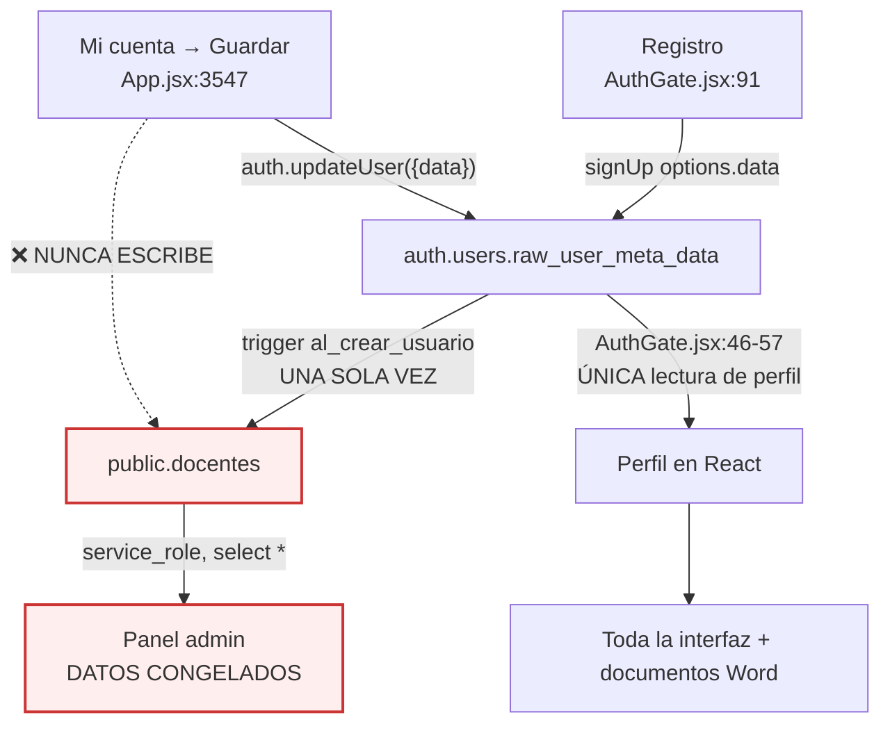
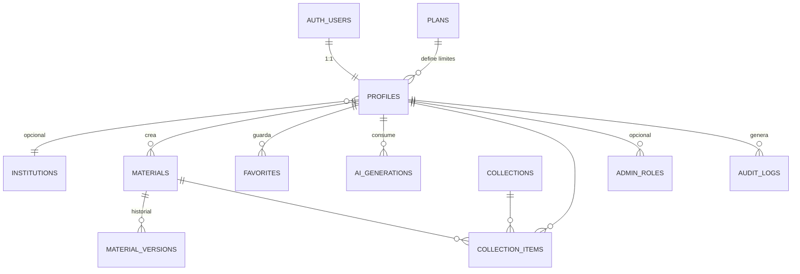

# 07 — Auditoría de Supabase y base de datos

> ⚠️ **No se ejecutó ningún SQL.** Este documento analiza los cuatro archivos `.sql` versionados y cómo los usa el código. El estado real de la base de datos depende de qué archivos se ejecutaron y en qué orden — algo que no se puede determinar desde el repositorio y que es, en sí mismo, uno de los hallazgos.

---

## 1. Inventario

### Archivos SQL

| Archivo | Líneas | Contenido |
|---|---|---|
| `supabase-schema.sql` | 122 | Esquema base: `docentes`, `materiales_docente`, RLS, trigger |
| `supabase-freemium.sql` | 186 | Columnas de créditos + 3 funciones RPC |
| `supabase-session-resources.sql` | 199 | Repite lo de freemium + amplía `tipo` a **6** valores |
| `supabase-session-flow-v2.sql` | 22 | Amplía `tipo` a **9** valores |

**Ninguno lleva número de versión ni marca de aplicación.** No hay tabla de migraciones. No hay forma de saber qué se ejecutó.

### Objetos de base de datos

| Tipo | Cantidad | Nombres |
|---|---|---|
| Tablas | **2** | `docentes`, `materiales_docente` |
| Funciones | **3** | `get_ai_credit_status`, `consume_ai_credit`, `refund_ai_credit` |
| Triggers | **1** | `al_crear_usuario` sobre `auth.users` |
| Políticas RLS | **6** | 2 en `docentes`, 4 en `materiales_docente` |
| Índices explícitos | **4** | 3 de unicidad en `docentes`, 1 compuesto en `materiales_docente` |

---

## 2. Esquema actual

### 2.1 `public.docentes`

| Columna | Tipo | Restricciones | ¿La usa la app? |
|---|---|---|---|
| `id` | uuid | PK, `default gen_random_uuid()` | ❌ |
| `user_id` | uuid | FK → `auth.users(id)` ON DELETE CASCADE, único | ⚠️ solo el trigger |
| `nombres` | text | NOT NULL | ⚠️ solo el admin |
| `apellidos` | text | NOT NULL | ⚠️ solo el admin |
| `ie` | text | NOT NULL | ⚠️ solo el admin |
| `celular` | text | — | ⚠️ solo el admin |
| `nivel` | text | NOT NULL, default `'primaria'`, CHECK primaria/secundaria | ❌ |
| `correo` | text | NOT NULL, único | ⚠️ solo el admin |
| `plan` | text | NOT NULL, default `'gratuito'` | ❌ **nunca leído** |
| `activo` | boolean | NOT NULL, default `true` | ⚠️ solo `consume_ai_credit` |
| `created_at` | timestamptz | NOT NULL, default `now()` | ⚠️ solo el admin |
| `ai_weekly_limit` | integer | NOT NULL, default 5, CHECK ≥ 0 | ⚠️ solo las RPC |
| `ai_week_used` | integer | NOT NULL, default 0, CHECK ≥ 0 | ⚠️ solo las RPC |
| `ai_week_start` | date | default lunes en `America/Lima` | ⚠️ solo las RPC |

**Hallazgo central: la aplicación no lee esta tabla.** `AuthGate.jsx:46-57` construye el perfil íntegramente desde `session.user.user_metadata`. La única lectura de `docentes` en toda la aplicación viva es la del panel administrativo, vía `service_role`.

### 2.2 `public.materiales_docente`

| Columna | Tipo | Restricciones | ¿La usa la app? |
|---|---|---|---|
| `id` | uuid | PK | ✅ |
| `user_id` | uuid | FK → `auth.users(id)` CASCADE, NOT NULL | ✅ |
| `tipo` | text | NOT NULL, **CHECK contradictorio** | ✅ |
| `titulo` | text | NOT NULL | ✅ |
| `nivel`, `grado`, `area`, `tema` | text | — | ✅ |
| `contenido` | jsonb | NOT NULL, default `'{}'` | ✅ |
| `created_at` | timestamptz | NOT NULL, default `now()` | ✅ |
| `updated_at` | timestamptz | NOT NULL, default `now()` | ❌ **nunca se actualiza** |

Índice: `materiales_docente_user_created_idx (user_id, created_at desc)` — correcto para la consulta principal.

### 2.3 Trigger `al_crear_usuario`

```sql
create or replace function public.crear_perfil_docente()
returns trigger language plpgsql
security definer set search_path = ''
as $$
begin
  insert into public.docentes (user_id, nombres, apellidos, ie, celular, nivel, correo)
  values (new.id,
          coalesce(new.raw_user_meta_data ->> 'nombres', 'Docente'), ...)
  on conflict (correo) do update set ...;
  return new;
end; $$;
```

Bien construido: `SECURITY DEFINER` con `search_path = ''` (evita secuestro de esquema) y `ON CONFLICT` que hace la operación reejecutable.

**Pero:** es lo único que escribe en `docentes`. Después del registro, la tabla nunca se actualiza.

---

## 3. Problemas identificados

### 3.1 🔴 P0 — Restricciones `CHECK` contradictorias sobre `tipo`

Tres archivos definen la misma restricción con valores distintos:

| Archivo | Valores permitidos |
|---|---|
| `supabase-schema.sql:79` | `session, project, rubric, checklist` |
| `supabase-session-resources.sql:190` | `session, project, rubric, checklist, worksheet, rating_scale` |
| `supabase-session-flow-v2.sql:9` | `session, project, rubric, checklist, observation_guide, rating_scale, worksheet, reading, questionnaire` |

Los dos últimos hacen `drop constraint if exists` seguido de `add constraint`. **El último ejecutado gana.**

Los tipos que la aplicación escribe:

| Tipo | `schema` | `resources` | `flow-v2` |
|---|---|---|---|
| `session` | ✅ | ✅ | ✅ |
| `project` | ✅ | ✅ | ✅ |
| `rubric` | ✅ | ✅ | ✅ |
| `checklist` | ✅ | ✅ | ✅ |
| `worksheet` | ❌ | ✅ | ✅ |
| `rating_scale` | ❌ | ✅ | ✅ |
| `reading` | ❌ | ❌ | ✅ |
| **`challenge`** | ❌ | ❌ | ❌ |

**Consecuencias:**

1. **`challenge` no está permitido en ningún archivo.** `App.jsx:3503` guarda retos con ese tipo → **todo reto generado con IA falla al guardarse.** El crédito ya se gastó, el error crudo de Postgres llega a la pantalla y el trabajo se pierde. Ver `02-SCREEN-INVENTORY.md` B7.
2. **`reading` depende del orden.** Si `supabase-session-resources.sql` se ejecutó después de `supabase-session-flow-v2.sql`, la "Ficha de lectura" de producción falla al guardar. Si fue al revés, funciona. **Desde el repositorio no hay forma de saberlo.**

**Solución.** Una migración autoritativa única que incluya los 10 valores (los 9 de `flow-v2` más `challenge`), y a medio plazo sustituir el `CHECK` por un `enum` o una tabla de referencia `tipos_material`.

### 3.2 🔴 P0 — El perfil vive en dos lugares que nunca se sincronizan



**Impactos concretos:**

1. Una docente que corrige su institución en "Mi cuenta" sigue viendo la anterior en el panel admin **para siempre**.
2. Los documentos Word usan `profile.ie` desde metadata (`App.jsx:150`), así que muestran el valor nuevo — pero el admin ve el viejo. **Dos verdades simultáneas.**
3. `docentes.nivel` nunca se actualiza si la docente cambia de nivel.
4. `docentes.plan` existe, tiene default `'gratuito'`, y **nadie lo lee**: por eso el sidebar muestra "Gratuito" codificado en duro (`App.jsx:3661`).

**Solución.** Tomar `docentes` como fuente de verdad: leerla al iniciar sesión y escribir en ella (además de en metadata, que sirve de caché en el JWT) al editar el perfil.

### 3.3 🟠 P1 — `docentes` sin política de INSERT

Las políticas activas tras `supabase-schema.sql`:

```sql
drop policy if exists "Cualquiera puede registrarse" on public.docentes;  -- eliminada
create policy "Docente lee su perfil"      ... for select ... using (auth.uid() = user_id);
create policy "Docente actualiza su perfil" ... for update ... using (auth.uid() = user_id);
```

No hay política de INSERT ni de DELETE. Con RLS activa, eso significa **prohibido**.

Es **correcto por diseño** —el trigger es `SECURITY DEFINER` y no está sujeto a RLS—, pero:

- `src/App.jsx:1243` (muerto) todavía intenta `supabase.from("docentes").insert([form])`. Si alguien reviviera ese código, fallaría de forma silenciosa y desconcertante.
- Sin política de DELETE, **una docente no puede eliminar su propio perfil**, lo que bloquea cualquier función de "eliminar mi cuenta" (ver `03-UX-AUDIT.md` §9.2).

**Solución.** Documentar la ausencia de INSERT como intencional y añadir política de DELETE cuando se implemente el borrado de cuenta.

### 3.4 🟠 P1 — `updated_at` declarada y nunca actualizada

`materiales_docente.updated_at` tiene `default now()` pero **ninguna sentencia UPDATE existe en la aplicación** (los materiales no se pueden editar, ver `03-UX-AUDIT.md` §5.5).

Cuando se implemente la edición, hará falta un trigger:

```sql
-- PROPUESTO — todavía no existe
create or replace function public.touch_updated_at()
returns trigger language plpgsql as $$
begin new.updated_at = now(); return new; end; $$;

create trigger materiales_docente_touch
  before update on public.materiales_docente
  for each row execute procedure public.touch_updated_at();
```

### 3.5 🟠 P1 — Los favoritos no están en la base de datos

"Guardados" vive en `localStorage` con la clave `sciverse-saved-resources` (`App.jsx:3602`). No hay tabla.

Cambiar de dispositivo o limpiar el navegador borra todos los favoritos sin aviso ni recuperación.

**Solución.** Tabla `favoritos` con RLS por `user_id`, migrando lo que haya en `localStorage` en el primer acceso.

### 3.6 🟡 P2 — Índices únicos redundantes en `correo`

```sql
create unique index if not exists docentes_correo_key       on public.docentes(lower(correo));
create unique index if not exists docentes_correo_exact_key on public.docentes(correo);
```

Más el `unique` de la definición de columna. **Tres restricciones de unicidad sobre el mismo campo.**

Peor: el trigger hace `on conflict (correo)`, que solo puede resolver contra el índice exacto, no el de `lower()`. Si alguien se registrara con `Maria@x.com` existiendo `maria@x.com`, el `ON CONFLICT` no lo capturaría y la inserción fallaría con violación del índice de `lower()` — **rompiendo el registro completo**, porque el trigger corre dentro de la transacción de `auth.users`.

**Solución.** Normalizar el correo a minúsculas antes de insertar (`AuthGate.jsx:92` ya hace `.toLowerCase()` en el cliente, pero el trigger usa `new.email` de Supabase) y conservar un solo índice único.

### 3.7 🟡 P2 — `ai_week_start` con default no determinista

```sql
alter table public.docentes
  alter column ai_week_start
  set default date_trunc('week', timezone('America/Lima', now()))::date;
```

Funciona, pero las tres funciones RPC recalculan el mismo valor en cada llamada. Si la zona horaria del proyecto cambiara, el reinicio semanal se desplazaría para todos.

**Solución.** Una función `public.current_week_start()` inmutable y reutilizada por las tres RPC y el default.

### 3.8 🟡 P2 — Sin índices para las consultas futuras

Solo existe `(user_id, created_at desc)`. Las funciones previstas necesitarán más:

- Filtro por tipo → `(user_id, tipo, created_at desc)`
- Búsqueda por texto → índice GIN sobre `to_tsvector('spanish', titulo || ' ' || tema || ' ' || area)`
- Métricas de admin → `(created_at)` sobre `docentes`

No es urgente con el volumen actual, pero la búsqueda de la biblioteca ya se hace **en el cliente** (`App.jsx:3622`) sobre los 100 registros que trae `.limit(100)`: **una docente con más de 100 materiales no puede encontrar los más antiguos.**

### 3.9 🟡 P2 — La consulta de biblioteca depende implícitamente de RLS

```js
// App.jsx:3606
const { data } = await supabase.from("materiales_docente")
  .select("id,tipo,titulo,...").order("created_at",{ascending:false}).limit(100);
```

No hay `.eq("user_id", user.id)`. Funciona porque RLS filtra, y es el uso correcto de RLS. Pero si alguien desactivara RLS por error durante una depuración, **esta consulta expondría los materiales de todos los docentes** sin que nada más falle.

**Solución.** Añadir el filtro explícito como defensa en profundidad. Cuesta una línea.

### 3.10 🟡 P2 — Sin tabla de generaciones de IA

No se registra ninguna generación: ni qué se pidió, ni cuántos tokens costó, ni si tuvo éxito. `ai_week_used` es un simple contador.

**Consecuencias:** no se puede calcular el coste real por docente, ni detectar abuso, ni ofrecer historial, ni medir la calidad del output, ni reintentar una generación fallida.

### 3.11 🟢 P3 — Sin borrado lógico

`deleteMaterial` (`App.jsx:3624`) borra definitivamente. Sin papelera ni recuperación.

---

## 4. Evaluación de RLS

| Tabla | RLS | SELECT | INSERT | UPDATE | DELETE | Valoración |
|---|---|---|---|---|---|---|
| `docentes` | ✅ activa | `auth.uid() = user_id` | ninguna | `auth.uid() = user_id` | ninguna | 🟢 Correcta. Falta DELETE para borrado de cuenta |
| `materiales_docente` | ✅ activa | `auth.uid() = user_id` | `auth.uid() = user_id` | `auth.uid() = user_id` | `auth.uid() = user_id` | 🟢 Correcta y completa |

**RLS es el aspecto mejor resuelto de la base de datos.** El aislamiento entre docentes es sólido y las políticas usan `auth.uid()` correctamente en `using` y `with check`.

### Funciones RPC

Las tres son `SECURITY DEFINER` con `set search_path = public` y permisos correctos:

```sql
revoke all on function public.consume_ai_credit() from public;
grant execute on function public.consume_ai_credit() to authenticated;
```

`consume_ai_credit` usa `SELECT ... FOR UPDATE` (`supabase-freemium.sql:97`), lo que **previene el doble consumo concurrente**. Es un detalle de calidad que merece reconocimiento.

**Observación (P2).** `set search_path = public` es más permisivo que el `set search_path = ''` del trigger. Fijarlo a `''` y calificar los nombres sería más estricto.

---

## 5. ¿Es suficiente la base de datos actual?

**No.** Soporta lo que hay hoy, pero bloquea casi todo lo que el producto necesita:

| Necesidad del producto | ¿Soportada? | Qué falta |
|---|---|---|
| Guardar y listar materiales | ✅ | — |
| Límite semanal de IA | ⚠️ parcial | Las rutas principales no lo consumen (backend) |
| Perfil editable y coherente | ❌ | La app no lee la tabla |
| Favoritos sincronizados | ❌ | No hay tabla |
| Historial de generaciones | ❌ | No hay tabla |
| Coste real por docente | ❌ | No se registran tokens |
| Editar un material | ❌ | Sin UPDATE ni versiones |
| Organizar en colecciones | ❌ | No hay tabla |
| Roles de administración | ❌ | Un secreto compartido |
| Auditoría | ❌ | No existe |
| Planes y pagos | ❌ | `plan` es texto libre sin leer |
| Onboarding y preferencias | ❌ | No hay dónde guardarlas |
| Búsqueda en más de 100 materiales | ❌ | Filtrado en cliente con `limit(100)` |

---

## 6. Modelo de datos V2 propuesto

> **PROPUESTO — nada de esto existe todavía. No se ejecutó ningún SQL.**

Principio: **no crear tablas innecesarias.** Cada una responde a una necesidad concreta identificada en esta auditoría.



### 6.1 `profiles` — sustituye a `docentes`

Cambio clave: **`user_id` pasa a ser la clave primaria**, eliminando el `id` sintético que hoy causa confusión.

```sql
-- PROPUESTO
create table public.profiles (
  user_id        uuid primary key references auth.users(id) on delete cascade,
  nombres        text not null default 'Docente',
  apellidos      text not null default '',
  correo         text not null,
  celular        text,
  nivel          text not null default 'primaria' check (nivel in ('primaria','secundaria')),
  grados         text[] not null default '{}',       -- ← nuevo: precarga formularios
  areas          text[] not null default '{}',       -- ← nuevo: recomendaciones
  region         text,                               -- ← nuevo: hoy se reescribe en cada formulario
  institution_id uuid references public.institutions(id) on delete set null,
  ie_nombre      text,                               -- texto libre mientras no haya institución
  plan_id        text not null default 'gratuito' references public.plans(id),
  activo         boolean not null default true,
  onboarding_completed_at timestamptz,               -- ← nuevo
  created_at     timestamptz not null default now(),
  updated_at     timestamptz not null default now()
);
```

**Por qué `grados`, `areas` y `region`:** hoy la docente los reescribe en **cada** formulario de generación. Guardarlos en el perfil elimina esa fricción repetida y habilita recomendaciones.

**Por qué no más campos:** "ciudad", "intereses" y "objetivos" se descartan — no alimentan ninguna función y alargan el registro sin retorno. Ver `06-` del análisis de onboarding en `03-UX-AUDIT.md` §1.4.

### 6.2 `institutions` — solo si se busca el mercado institucional

```sql
-- PROPUESTO
create table public.institutions (
  id         uuid primary key default gen_random_uuid(),
  nombre     text not null,
  codigo_modular text unique,          -- identificador oficial peruano
  region     text, provincia text, distrito text,
  tipo       text check (tipo in ('publica','privada')),
  created_at timestamptz not null default now()
);
```

**Recomendación:** **no crearla todavía.** Mientras `ie` sea texto libre no aporta. Crearla cuando exista una decisión de vender a colegios completos. Hoy sería una tabla vacía que complica las consultas.

### 6.3 `plans` — fuente única de límites

```sql
-- PROPUESTO
create table public.plans (
  id              text primary key,          -- 'gratuito' | 'mensual' | 'anual'
  nombre          text not null,
  precio_soles    numeric(8,2) not null default 0,
  periodo         text,
  ai_weekly_limit integer not null,          -- -1 = ilimitado
  features        jsonb not null default '{}',
  activo          boolean not null default true,
  orden           integer not null default 0
);
```

**Resuelve directamente** la contradicción de precios documentada en `03-UX-AUDIT.md` §1.2: hoy hay cuatro cifras distintas en cuatro sitios. Con esta tabla hay una.

### 6.4 `materials` — evolución de `materiales_docente`

```sql
-- PROPUESTO
create table public.materials (
  id          uuid primary key default gen_random_uuid(),
  user_id     uuid not null references auth.users(id) on delete cascade,
  tipo        text not null references public.material_types(id),   -- ← en vez de CHECK
  titulo      text not null,
  nivel text, grado text, area text, tema text, region text,
  contenido   jsonb not null default '{}',
  origen      text not null default 'ai' check (origen in ('ai','manual','duplicado','plantilla')),
  parent_id   uuid references public.materials(id) on delete set null,  -- vincula instrumento↔sesión
  generation_id uuid references public.ai_generations(id) on delete set null,
  deleted_at  timestamptz,                                          -- ← papelera
  created_at  timestamptz not null default now(),
  updated_at  timestamptz not null default now()
);

create table public.material_types (
  id     text primary key,   -- session, project, rubric, checklist, worksheet,
  label  text not null,      -- reading, questionnaire, observation_guide,
  grupo  text not null,      -- rating_scale, challenge, wordsearch, crossword
  activo boolean not null default true
);
```

**Tres mejoras clave:**

1. **`material_types` sustituye al `CHECK`.** Añadir un tipo pasa a ser un `INSERT`, no una migración de esquema. Elimina de raíz la contradicción entre archivos SQL y el fallo de `challenge`.
2. **`parent_id`** vincula el instrumento con su sesión — hoy esa relación existe en la interfaz ("Crear instrumento desde esta sesión") pero **no se guarda**.
3. **`deleted_at`** habilita la papelera de 30 días.

### 6.5 `material_versions` — historial

```sql
-- PROPUESTO
create table public.material_versions (
  id          uuid primary key default gen_random_uuid(),
  material_id uuid not null references public.materials(id) on delete cascade,
  version     integer not null,
  contenido   jsonb not null,
  cambio      text,               -- 'generado' | 'editado' | 'regenerado:criterios'
  created_at  timestamptz not null default now(),
  unique (material_id, version)
);
```

Habilita la edición sin miedo (`03-UX-AUDIT.md` §5.5) y la regeneración parcial.

### 6.6 `ai_generations` — el registro que hoy no existe

```sql
-- PROPUESTO
create table public.ai_generations (
  id            uuid primary key default gen_random_uuid(),
  user_id       uuid not null references auth.users(id) on delete cascade,
  tipo          text not null,        -- session | project | resource | challenge | suggestion
  modo          text,                 -- alignment | sequence | assessment | annexes
  modelo        text not null,
  prompt_version text,                -- ← permite A/B de prompts
  input         jsonb not null default '{}',
  status        text not null check (status in ('pending','success','failed','refunded')),
  error_code    text,
  tokens_input  integer,
  tokens_output integer,
  duration_ms   integer,
  credit_consumed boolean not null default false,
  material_id   uuid references public.materials(id) on delete set null,
  created_at    timestamptz not null default now()
);

create index ai_generations_user_created_idx on public.ai_generations(user_id, created_at desc);
create index ai_generations_status_idx       on public.ai_generations(status, created_at desc);
```

**Esta es la tabla más importante del modelo V2.** Sin ella no se puede:

- calcular el coste real por docente ni por plan;
- detectar abuso o patrones anómalos;
- ofrecer historial y reintento de generaciones fallidas;
- medir qué versión de prompt produce mejores resultados;
- responder "¿por qué me cobró un crédito si falló?".

### 6.7 `ai_usage` — contador derivado

```sql
-- PROPUESTO
create table public.ai_usage (
  user_id     uuid not null references auth.users(id) on delete cascade,
  week_start  date not null,
  used        integer not null default 0,
  limit_snapshot integer not null,
  primary key (user_id, week_start)
);
```

Sustituye a `ai_week_used`/`ai_week_start` en `profiles`. Ventaja: **conserva el historial semanal** en lugar de sobrescribirlo, lo que permite ver la evolución de uso de cada docente.

### 6.8 `favorites`

```sql
-- PROPUESTO
create table public.favorites (
  user_id     uuid not null references auth.users(id) on delete cascade,
  item_kind   text not null check (item_kind in ('activity','challenge','material','template')),
  item_id     text not null,
  payload     jsonb,             -- caché para catálogo estático
  created_at  timestamptz not null default now(),
  primary key (user_id, item_kind, item_id)
);
```

Reemplaza `localStorage` (§3.5). Migración en el primer acceso.

### 6.9 `collections` y `collection_items`

```sql
-- PROPUESTO
create table public.collections (
  id         uuid primary key default gen_random_uuid(),
  user_id    uuid not null references auth.users(id) on delete cascade,
  nombre     text not null,
  descripcion text,
  color      text,
  created_at timestamptz not null default now()
);

create table public.collection_items (
  collection_id uuid not null references public.collections(id) on delete cascade,
  material_id   uuid not null references public.materials(id) on delete cascade,
  orden         integer not null default 0,
  primary key (collection_id, material_id)
);
```

Resuelve la falta de organización (`03-UX-AUDIT.md` §6.3): "Unidad 3 - Ecosistemas", "4.º B".

### 6.10 `admin_roles`

```sql
-- PROPUESTO
create table public.admin_roles (
  user_id    uuid primary key references auth.users(id) on delete cascade,
  rol        text not null check (rol in ('superadmin','soporte','analista')),
  otorgado_por uuid references auth.users(id),
  created_at timestamptz not null default now()
);

create or replace function public.is_admin(min_rol text default 'analista')
returns boolean language sql stable security definer set search_path = '' as $$
  select exists (select 1 from public.admin_roles where user_id = auth.uid());
$$;
```

Elimina `ADMIN_SECRET`. Detalle en `13-ADMIN-AUDIT.md`.

### 6.11 `audit_logs`

```sql
-- PROPUESTO
create table public.audit_logs (
  id          bigserial primary key,
  actor_id    uuid references auth.users(id) on delete set null,
  accion      text not null,          -- 'admin.view_teachers', 'profile.delete', ...
  entidad     text, entidad_id text,
  metadata    jsonb not null default '{}',
  ip          inet,
  created_at  timestamptz not null default now()
);
```

Necesaria en cuanto exista más de un administrador y para cumplir con protección de datos.

### 6.12 Suscripciones — **no recomendada todavía**

El producto cobra hoy por Yape/Plin confirmado por WhatsApp (`App.jsx:2825`). Una tabla `subscriptions` con ciclos, renovaciones y estados **no aporta nada mientras el pago sea manual**.

**Recomendación:** con `plans` y `profiles.plan_id` basta. Añadir `subscriptions` solo cuando exista una pasarela real. Crear ahora una tabla que nadie escribe correctamente es peor que no tenerla.

### 6.13 Resumen del modelo V2

| Tabla | Estado | Justificación |
|---|---|---|
| `profiles` | Evoluciona `docentes` | PK = `user_id`; añade grados, áreas, región, onboarding |
| `plans` | **Nueva** | Fuente única de precios y límites |
| `material_types` | **Nueva** | Elimina el `CHECK` contradictorio |
| `materials` | Evoluciona | Añade `parent_id`, `deleted_at`, `origen` |
| `material_versions` | **Nueva** | Habilita edición e historial |
| `ai_generations` | **Nueva** | Coste, abuso, historial, calidad de prompts |
| `ai_usage` | **Nueva** | Contador semanal con histórico |
| `favorites` | **Nueva** | Saca los favoritos de `localStorage` |
| `collections` + `collection_items` | **Nuevas** | Organización del trabajo |
| `admin_roles` | **Nueva** | Sustituye `ADMIN_SECRET` |
| `audit_logs` | **Nueva** | Trazabilidad |
| `institutions` | **Aplazada** | Solo con estrategia institucional |
| `subscriptions` | **No recomendada** | El pago es manual |

---

## 7. Estrategia de migración

**Sin migración destructiva.** Ningún dato de docente puede perderse.

| Fase | Acción | Riesgo |
|---|---|---|
| **M0** | Consolidar los 4 SQL en `migrations/001_baseline.sql` que refleje el estado real. **Corregir el `CHECK` de `tipo` incluyendo `challenge`.** | Bajo |
| **M1** | Crear `material_types` y poblarla; sustituir el `CHECK` por FK | Bajo |
| **M2** | Crear `plans`; poblarla desde `PLANS` (`App.jsx:2427`); añadir `plan_id` a `docentes` con respaldo del texto actual | Bajo |
| **M3** | Renombrar `docentes` → `profiles` con **vista de compatibilidad** `docentes` para no romper el admin. Añadir columnas nuevas con default | Medio |
| **M4** | Crear `ai_generations` y `ai_usage`; escribir en paralelo con `ai_week_used` durante dos semanas antes de cambiar la lectura | Medio |
| **M5** | Crear `favorites`; migrar `localStorage` en el primer acceso de cada docente | Bajo |
| **M6** | Crear `material_versions`; volcar el `contenido` actual como versión 1 | Bajo |
| **M7** | Crear `collections`, `admin_roles`, `audit_logs` | Bajo |
| **M8** | Retirar la vista de compatibilidad y las columnas antiguas | Medio |

**Cada migración debe:** llevar número, ser reejecutable, incluir su reversión, y probarse antes en un proyecto Supabase de staging — que **hoy no existe** y debería crearse antes de M0.

---

## 8. Resumen de prioridades

| # | Problema | Prioridad | Esfuerzo |
|---|---|---|---|
| D1 | `challenge` no permitido → ningún reto se guarda | **P0** | XS |
| D2 | `CHECK` contradictorios: `reading` depende del orden de ejecución | **P0** | XS |
| D3 | El perfil no se sincroniza entre metadata y `docentes` | **P0** | M |
| D4 | Sin registro de generaciones: coste y abuso invisibles | **P1** | M |
| D5 | Favoritos solo en `localStorage` | **P1** | S |
| D6 | Sin política de DELETE en `docentes` → no se puede borrar la cuenta | **P1** | XS |
| D7 | Sin tabla de migraciones; estado real desconocido | **P1** | S |
| D8 | `updated_at` nunca se actualiza | **P2** | XS |
| D9 | Tres índices únicos sobre `correo`; `ON CONFLICT` frágil | **P2** | S |
| D10 | Búsqueda en cliente con `limit(100)` | **P2** | M |
| D11 | Consulta de biblioteca sin filtro explícito de `user_id` | **P2** | XS |
| D12 | Sin índices para filtros y búsqueda futuros | **P2** | S |
| D13 | `search_path = public` en las RPC en vez de `''` | **P2** | XS |
| D14 | Sin borrado lógico ni papelera | **P3** | S |
| D15 | Sin entorno de staging en Supabase | **P1** | S |
