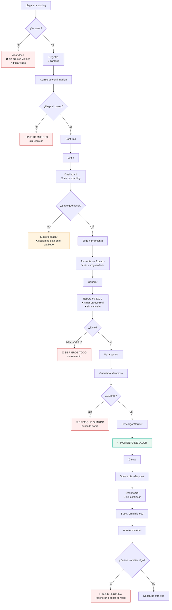
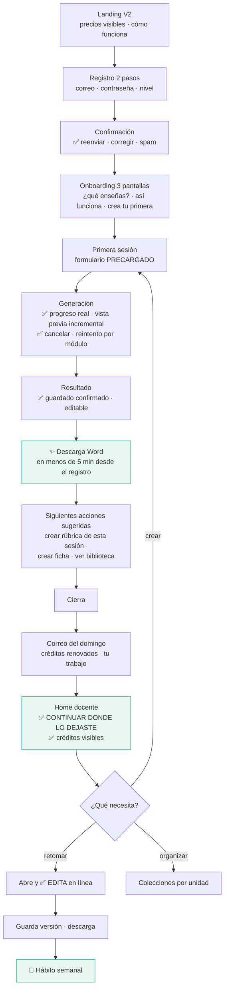
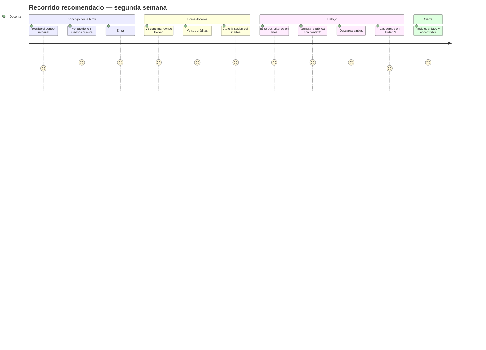

# 12 — Recorrido del docente

Mapa del recorrido actual con sus puntos de fricción, y el recorrido recomendado.

---

## PARTE I — Recorrido actual

### 1. Vista general

### 2. Los seis puntos de pérdida

| # | Dónde | Qué pasa | Referencia |
|---|---|---|---|
| **1** | Landing | Sin precios visibles y con un titular que no dice qué hace | `11-` §3.1, §3.4 |
| **2** | Confirmación | **Sin reenviar el correo.** Si no llega, la cuenta se pierde | `AuthGate.jsx:215` |
| **3** | Dashboard | Sin onboarding; la sesión de aprendizaje ni siquiera está en el catálogo de "Crear" | `03-` §2.2, §4.1 |
| **4** | Generación | Un fallo en el módulo 3 de 4 destruye todo el progreso | `App.jsx:948` |
| **5** | Guardado | Falla en silencio: la docente cree que guardó | `App.jsx:989` |
| **6** | Retorno | No puede editar lo generado; el dashboard no ofrece continuar | `App.jsx:3521` |

Los puntos 2, 4 y 5 son **fugas invisibles**: nadie se queja, simplemente no vuelven.

### 3. Análisis por etapa

#### 3.1 Descubrimiento

| Paso | Fricción | Impacto |
|---|---|---|
| Llega desde WhatsApp | Sin Open Graph, el enlace aparece desnudo → menos aperturas | Alto |
| Lee el hero | "Convierte tus ideas en experiencias STEAM" no menciona sesión, CNEB ni Word | Alto |
| Busca precios | Requiere abrir un modal; invisible para buscadores | Alto |
| Pulsa "Elegir plan mensual" | Lleva al registro, no al pago (`App.jsx:2601`) | Alto |

#### 3.2 Registro

| Paso | Fricción | Impacto |
|---|---|---|
| 8 campos en una pantalla | Institución y celular no son necesarios para empezar | Medio |
| Acepta términos | El texto **no es enlace** (`AuthGate.jsx:249`) | Medio |
| Escribe la contraseña | Sin mostrar/ocultar ni medidor; en móvil, a ciegas y dos veces | Alto |
| **Espera el correo** | **Sin reenvío, sin corregir el correo, sin aviso de spam** | **Crítico** |

#### 3.3 Primer uso

| Paso | Fricción | Impacto |
|---|---|---|
| Entra al dashboard | Cuatro categorías equivalentes; ninguna guía | Alto |
| Busca "sesión de aprendizaje" | **No está en el catálogo de Crear** en producción | Alto |
| Pulsa "Pregúntale a Kantu" | No lleva a ninguna parte | Medio |
| Elige "Crucigrama" | Devuelve sus propias pistas sin cuadrícula | Alto |

#### 3.4 Creación

| Paso | Fricción | Impacto |
|---|---|---|
| Completa 3 pasos | Sin autoguardado: recargar borra todo | Alto |
| Reescribe nivel, grado, área, región | Están en el perfil pero no se precargan | Medio |
| Genera | 60-120 s sin progreso real ni cancelación | Alto |
| Falla un módulo | **Se pierden los módulos ya generados y el formulario** | Crítico |
| Recibe la sesión | Contenido de buena calidad ✅ | — |
| El guardado falla | **Nadie se lo dice** | Crítico |
| Descarga Word | Documento con tablas y formato ✅ **Momento de valor** | — |

#### 3.5 Retorno

| Paso | Fricción | Impacto |
|---|---|---|
| Vuelve al dashboard | Sin "continuar donde lo dejaste" | Alto |
| Busca en la biblioteca | Solo los 100 más recientes; los tipos nuevos sin etiqueta ni filtro | Alto |
| Abre un material | **Solo lectura** | Crítico |
| Quiere cambiar un criterio | Regenerar (otro crédito) o editar el Word (pierde la copia) | Crítico |
| Descarga desde la biblioteca | Texto plano, **peor que la descarga original** | Alto |
| Consulta sus créditos | No existe en ninguna parte | Alto |

### 4. Momentos de verdad

| Momento | Estado | Qué decide |
|---|---|---|
| **Primeros 10 s en la landing** | 🟠 | Si entiende que es para él |
| **Recibir el correo** | 🔴 | Si la cuenta existe o se pierde |
| **Primeros 30 s en el dashboard** | 🔴 | Si encuentra por dónde empezar |
| **Los 120 s de espera** | 🟠 | Si aguanta o se va |
| **Abrir el .docx** | 🟢 | **Si el producto vale la pena** |
| **Volver la segunda vez** | 🔴 | Si se convierte en hábito |
| **Querer editar** | 🔴 | Si es una herramienta o un experimento |

El único momento verdaderamente logrado es **abrir el Word**. Todo lo demás pone obstáculos antes o después.

---

## PARTE II — Recorrido recomendado

### 5. Vista general

### 6. El primer uso, paso a paso

Objetivo: **del registro al primer Word descargado en menos de 5 minutos.**

| # | Pantalla | Qué pasa | Qué lo resuelve |
|---|---|---|---|
| 1 | Landing | Ve el precio, entiende el proceso, prueba la demo | `11-` V2 |
| 2 | Registro paso 1 | Correo, contraseña, nivel. **30 segundos** | `03-` §1.4 |
| 3 | Confirmación | Con reenvío, corrección de correo y aviso de spam | `03-` §2.1 |
| 4 | Onboarding 1 | "¿Qué enseñas?" — grados y áreas → **al perfil** | `07-` §6.1 |
| 5 | Onboarding 2 | "Así funciona" en 15 s | `03-` §2.2 |
| 6 | Onboarding 3 | "Crea tu primera sesión" → formulario **ya precargado** | `03-` §2.2 |
| 7 | Asistente | Solo falta tema, propósito y evidencia. Con autoguardado | `03-` §5.4 |
| 8 | Generación | Progreso con nombres pedagógicos + vista previa incremental | `04-` §3.11 |
| 9 | Resultado | "Guardado en tu biblioteca ✓" visible | `03-` §5.3 |
| 10 | Descarga | El .docx con formato. **Momento de valor** | ya funciona |
| 11 | Siguiente paso | "¿Creamos la rúbrica de esta sesión?" — con contexto heredado | `03-` §5.7 |

### 7. El retorno semanal

Frente al recorrido actual, donde este mismo camino tiene tres bloqueos: no hay "continuar", no se puede editar, y no hay colecciones.

### 8. Comparativa

| Etapa | Hoy | Recomendado |
|---|---|---|
| Campos de registro | 8 de golpe | 3 + opcionales después |
| Correo no llega | **Punto muerto** | Reenviar y corregir |
| Onboarding | Ninguno | 3 pantallas omitibles |
| Primer formulario | Todo a mano | Precargado desde el perfil |
| Tiempo al primer valor | Indeterminado | **< 5 minutos** |
| Durante la espera | Giro sin contexto | Progreso + vista previa |
| Si falla un módulo | **Se pierde todo** | Reintento de ese módulo |
| Guardado | Silencioso | Confirmado y visible |
| Créditos | Invisibles | Siempre a la vista |
| Al volver | Empieza de cero | Continuar donde lo dejó |
| Editar | **Imposible** | En línea, con versiones |
| Organizar | Lista plana | Colecciones por unidad |
| Retorno | Nada | Correo del domingo |

### 9. Qué desbloquea cada cambio

| Cambio | Desbloquea |
|---|---|
| Reenvío del correo | Todas las cuentas que hoy se pierden en silencio |
| Onboarding | Que la docente llegue al momento de valor |
| Formulario precargado | Reduce el asistente de 3 pasos a poco más de 1 |
| Guardado visible | Confianza en que el trabajo existe |
| Reintento por módulo | Que dos minutos de espera no se tiren |
| Créditos visibles | Que el límite no sea una sorpresa |
| "Continuar" | Que el producto se convierta en hábito |
| **Edición en línea** | **Que sea una herramienta de trabajo, no un generador de un solo uso** |
| Colecciones | Que la biblioteca siga siendo útil al crecer |
| Correo semanal | Que el retorno no dependa de que se acuerde sola |

### 10. Orden recomendado

Por relación impacto/esfuerzo, dentro del roadmap de `20-`:

| Orden | Cambio | Esfuerzo | Fase |
|---|---|---|---|
| 1 | Guardado visible con reintento | S | 0 |
| 2 | Créditos visibles (importar `CreditsIndicator`) | XS | 0 |
| 3 | Reenvío del correo de confirmación | S | 3 |
| 4 | Autoguardado del formulario | S | 3 |
| 5 | Reintento por módulo | M | 6 |
| 6 | "Continuar donde lo dejaste" | M | 4 |
| 7 | Onboarding de 3 pantallas | L | 3 |
| 8 | Formulario precargado desde el perfil | M | 3 |
| 9 | **Edición en línea** | L | 5 |
| 10 | Colecciones | M | 5 |
| 11 | Correo semanal | M | 7 |

Los dos primeros suman menos de medio día y eliminan las dos pérdidas de confianza más dañinas.
