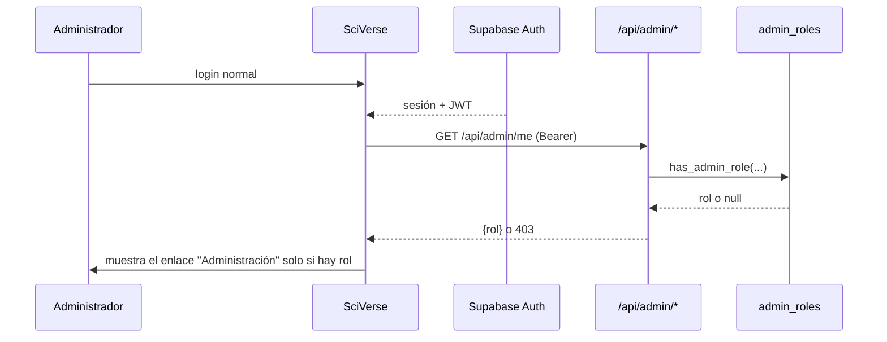

# 13 — Auditoría del panel administrativo y propuesta V2

Archivos: `AdminPanel.jsx` (103 líneas), `api/list-docentes.js` (36 líneas).

---

## PARTE I — Estado actual

### 1. Qué existe

El panel completo son **139 líneas**: un formulario de clave y una tabla.

```
/?admin=1  →  main.jsx:7 detecta el parámetro  →  renderiza <AdminPanel/>
              ↓
       formulario de clave
              ↓
   GET /api/list-docentes?secret=...
              ↓
   service_role → select("*") from docentes
              ↓
   tabla: nombres · apellidos · IE · correo · celular · fecha
```

### 2. Cómo se autentica

```js
// AdminPanel.jsx:23
const res = await fetch(`/api/list-docentes?secret=${encodeURIComponent(secret)}`);

// api/list-docentes.js:11
if (!process.env.ADMIN_SECRET || secret !== process.env.ADMIN_SECRET) {
  res.status(401).json({ error: "No autorizado" });
}
```

**Un único secreto compartido**, sin usuario, sin rol, sin caducidad, sin revocación individual y sin registro de accesos.

### 3. Qué puede consultar

Una sola cosa: la lista completa de docentes.

| Columna mostrada | Origen |
|---|---|
| Nombres, Apellidos | `docentes` |
| IE (institución) | `docentes` |
| Correo | `docentes` |
| Celular | `docentes` |
| Fecha de registro | `docentes` |

El endpoint hace `select("*")`, así que **también viajan al navegador** columnas que la tabla no muestra: `plan`, `activo`, `ai_weekly_limit`, `ai_week_used`, `ai_week_start`, `user_id`, `nivel`. Están ahí, en la respuesta, sin usarse.

### 4. Qué puede modificar

**Nada.** El panel es de solo lectura.

Para desactivar una cuenta, cambiar un plan tras un pago por Yape, o ajustar créditos, hay que entrar a la consola de Supabase y editar filas a mano.

### 5. Riesgos

| # | Riesgo | Severidad | Detalle |
|---|---|---|---|
| A1 | **Secreto en query string** | **P0** | Queda en logs de Vercel, historial del navegador y posible cabecera `Referer`. Sin `Referrer-Policy` porque no hay `vercel.json` |
| A2 | **Volcado de PII sin paginación** | **P0** | `select("*")` devuelve todos los docentes con correo y celular en una sola respuesta |
| A3 | **Sin límite de intentos** | **P0** | Peticiones ilimitadas contra un secreto elegido a mano → fuerza bruta viable |
| A4 | **Datos obsoletos** | **P1** | Lee `docentes`, que **nunca se actualiza** tras el registro (`07-` §3.2). Las decisiones se toman sobre información falsa |
| A5 | Sin identidad ni auditoría | **P1** | Secreto compartido: no se sabe quién consultó qué ni cuándo |
| A6 | Comparación no constante en tiempo | **P2** | `!==` en vez de `crypto.timingSafeEqual` |
| A7 | Panel en el bundle de todos | **P2** | `main.jsx:4` lo importa estáticamente: cada docente descarga el panel admin |
| A8 | Sin segundo factor | **P2** | Un solo secreto da acceso total |
| A9 | Sin caducidad ni rotación | **P2** | El secreto vive indefinidamente |

### 6. ¿Es `ADMIN_SECRET` adecuado para producción?

**No.** Sirvió para una versión inicial con pocos usuarios, pero falla en cuatro puntos que ya importan hoy:

| Requisito | ¿Lo cumple? | Por qué |
|---|---|---|
| Saber quién hizo qué | ❌ | Un secreto compartido no identifica a nadie |
| Revocar el acceso de una persona | ❌ | Hay que rotarlo para todos |
| Distinguir niveles de acceso | ❌ | Todo o nada |
| Cumplir con protección de datos | ❌ | Sin auditoría de accesos a PII |
| Resistir fuerza bruta | ❌ | Sin límite de intentos |
| No filtrarse por canales secundarios | ❌ | Viaja en la URL |

**Mitigación inmediata** (mientras se construye el V2), en menos de una hora:

1. Mover el secreto a la cabecera `Authorization`.
2. `crypto.timingSafeEqual` para la comparación.
3. Paginar y limitar las columnas devueltas.
4. Limitación de intentos por IP.
5. **Rotar el secreto actual**, que ya está en los logs históricos de Vercel.
6. `Referrer-Policy: strict-origin-when-cross-origin` en `vercel.json`.

Esto no arregla la arquitectura, pero cierra las tres P0.

---

## PARTE II — Admin V2 propuesto

> **PROPUESTO — nada de esto existe todavía.**

### 7. Modelo de roles

Sustituir el secreto compartido por roles reales en Supabase, aprovechando la infraestructura de auth que ya existe.

```sql
-- PROPUESTO
create table public.admin_roles (
  user_id      uuid primary key references auth.users(id) on delete cascade,
  rol          text not null check (rol in ('superadmin','soporte','analista')),
  otorgado_por uuid references auth.users(id),
  created_at   timestamptz not null default now()
);

create or replace function public.has_admin_role(roles text[])
returns boolean language sql stable security definer set search_path = '' as $$
  select exists (
    select 1 from public.admin_roles
    where user_id = auth.uid() and rol = any(roles)
  );
$$;
```

| Rol | Puede |
|---|---|
| **superadmin** | Todo, incluido otorgar y revocar roles |
| **soporte** | Ver docentes, ajustar créditos, activar/desactivar cuentas, ver generaciones fallidas |
| **analista** | Solo métricas agregadas. **Sin acceso a datos personales** |

**Ventaja decisiva:** el acceso se otorga a una persona identificada, se revoca individualmente, y cada acción queda registrada con su autor.

### 8. Autenticación

El administrador **inicia sesión como cualquier docente** (mismo Supabase Auth), y el sistema comprueba su rol.



Beneficios frente al modelo actual: sin secretos que rotar, revocación instantánea, segundo factor heredado de Supabase, y auditoría con nombre y apellido.

### 9. Áreas del panel

#### 9.1 Resumen

Lo primero que ve un administrador: el estado del negocio de un vistazo.

```
┌──────────────────────────────────────────────────────────┐
│ Resumen · últimos 30 días                                │
├──────────────┬──────────────┬──────────────┬─────────────┤
│ Docentes     │ Activos 7d   │ Generaciones │ Coste IA    │
│ 342  ▲12     │ 89  (26%)    │ 1.204        │ S/ 87       │
├──────────────┴──────────────┴──────────────┴─────────────┤
│ [gráfico: registros y generaciones por día]              │
├──────────────────────────────────────────────────────────┤
│ ⚠ 3 generaciones fallidas sin crédito devuelto           │
│ ⚠ 12 cuentas sin confirmar hace más de 7 días            │
└──────────────────────────────────────────────────────────┘
```

Las dos alertas del pie son accionables: la primera permite compensar créditos perdidos (`08-` P1-9); la segunda detecta el punto muerto del correo de confirmación (`03-` §2.1).

#### 9.2 Docentes

| Función | Hoy | V2 |
|---|---|---|
| Listar | ✅ todo de golpe | Paginado, 50 por página |
| Buscar | ❌ | Por nombre, correo o institución |
| Filtrar | ❌ | Por nivel, plan, estado, fecha |
| Ver detalle | ❌ | Perfil, materiales, consumo, historial |
| Activar / desactivar | ❌ | Con motivo, registrado en auditoría |
| Cambiar plan | ❌ | Tras confirmar el pago por Yape/Plin |
| Ajustar créditos | ❌ | Con motivo obligatorio |
| Reenviar confirmación | ❌ | Resuelve el punto muerto del correo |
| Exportar | ❌ | CSV, registrado en auditoría |

**Importante:** el celular queda **oculto por defecto**, tras un botón "mostrar" que registra el acceso. Es el dato más sensible y el que menos se necesita.

#### 9.3 Uso de IA

Requiere la tabla `ai_generations` (`07-` §6.6), hoy inexistente.

- Generaciones por día, tipo y modelo
- Tokens y coste estimado, por docente y por plan
- Tasa de fallo por tipo — detecta qué generador falla más
- **Docentes con consumo anómalo** — señal temprana de abuso
- Generaciones fallidas sin crédito devuelto, con acción de compensar

Esto responde preguntas que hoy son imposibles: cuánto cuesta realmente un docente gratuito, si el plan mensual es rentable, y qué falla más.

#### 9.4 Contenido

- Materiales creados por tipo y por área
- **Tipos que fallan al guardarse** — habría detectado el problema de `challenge` (`07-` §3.1) el primer día
- Temas más frecuentes → base para plantillas y contenido de marketing

#### 9.5 Métricas de producto

| Métrica | Para qué |
|---|---|
| Registro → confirmación | Mide la fuga del correo |
| Confirmación → primera generación | Mide si el onboarding funciona |
| Docentes que vuelven a la semana | Mide si hay hábito |
| Generaciones por docente activo | Mide el uso real |
| Distribución por nivel, área y región | Orienta el contenido |

#### 9.6 Errores

Alimentado por el registro estructurado (`06-` §3.3):

- Últimos errores por endpoint, con `request_id` y usuario
- Errores de guardado agrupados por causa
- Fallos de Gemini por tipo

#### 9.7 Capacitación y feedback

- Inscripciones a capacitaciones (hoy todo por WhatsApp)
- Constancias emitidas
- Comentarios y valoraciones de los materiales generados — **hoy no se recoge ninguno**

#### 9.8 Configuración

- Editar planes, precios y límites — resolvería la contradicción de precios (`03-` §1.2) desde el panel
- Activar y desactivar herramientas sin desplegar — permitiría **retirar "Crucigrama" sin tocar código** (`10-` §3)
- Mensajes de mantenimiento

#### 9.9 Auditoría

```sql
-- PROPUESTO
create table public.audit_logs (
  id         bigserial primary key,
  actor_id   uuid references auth.users(id) on delete set null,
  accion     text not null,
  entidad    text, entidad_id text,
  metadata   jsonb not null default '{}',
  ip         inet,
  created_at timestamptz not null default now()
);
```

Se registra: consultas al listado, visualización de celular, cambios de plan o créditos, activaciones y desactivaciones, exportaciones y cambios de rol.

### 10. Arquitectura propuesta

```
api/admin/                        ← PROPUESTO
├── _guard.js                     ← requireAdminRole(['superadmin','soporte'])
├── me.js                         ← devuelve el rol del usuario actual
├── teachers.js                   ← listar, buscar, paginar
├── teacher/[id].js               ← detalle y acciones
├── metrics.js                    ← agregados (accesible a 'analista')
├── ai-usage.js
├── errors.js
├── settings.js                   ← solo superadmin
└── audit.js                      ← solo superadmin

src/features/admin/               ← PROPUESTO
├── AdminLayout.jsx
├── Overview.jsx · Teachers.jsx · TeacherDetail.jsx
├── AiUsage.jsx · Content.jsx · Metrics.jsx
├── Errors.jsx · Settings.jsx · AuditLog.jsx
```

Con `React.lazy`, para que el panel deje de viajar en el bundle de todos los docentes (A7).

### 11. Seguridad del V2

| Medida | Cómo |
|---|---|
| Sin secretos compartidos | Roles en base de datos |
| Autorización por rol | `_guard.js` en cada endpoint, negando por defecto |
| Segundo factor | Heredado de Supabase Auth |
| Auditoría completa | `audit_logs` |
| PII minimizada | Columnas explícitas; celular oculto tras acción registrada |
| Limitación de tasa | Por usuario administrador |
| Revocación instantánea | Borrar una fila de `admin_roles` |
| Sin acceso a PII para analistas | Endpoints separados y agregados |
| Ruta protegida | `/admin` con router, no `?admin=1` |

### 12. Plan de migración

| Fase | Acción | Riesgo |
|---|---|---|
| **0** | Mitigación inmediata: cabecera, comparación segura, paginación, límite de intentos, rotar el secreto | Bajo |
| **1** | Crear `admin_roles` y `has_admin_role`; asignar el primer superadmin | Bajo |
| **2** | Crear `_guard.js` y `/api/admin/me`; nueva ruta `/admin` con login normal | Bajo |
| **3** | Portar el listado de docentes con paginación y búsqueda | Bajo |
| **4** | **Retirar `ADMIN_SECRET` y `?admin=1`** | Medio — coordinar con quien lo use |
| **5** | Añadir `audit_logs` y registrar todos los accesos | Bajo |
| **6** | Acciones de escritura: activar/desactivar, plan, créditos | Medio |
| **7** | Métricas y uso de IA — **requiere `ai_generations`** | Bajo |
| **8** | Configuración de planes y herramientas | Medio |

**La fase 0 se puede hacer hoy** y cierra las tres vulnerabilidades P0 sin esperar al resto.

### 13. Qué no construir todavía

| Función | Por qué esperar |
|---|---|
| Gestión de suscripciones y renovaciones | El pago es manual por Yape/Plin. Sin pasarela, es una tabla que nadie mantiene bien |
| Chat de soporte integrado | WhatsApp ya funciona y los docentes lo prefieren |
| Panel para instituciones | Sin `institutions` (aplazada en `07-` §6.2) no hay a quién mostrárselo |
| Editor de contenido | Las actividades son estáticas y estables |
| Pruebas A/B en el panel | Primero hace falta analítica (`19-`) |

Construir estas antes de tiempo añade superficie de mantenimiento sin usuarios reales.

---

## Resumen

| # | Acción | Prioridad | Esfuerzo |
|---|---|---|---|
| AD1 | Sacar el secreto de la query string y **rotarlo** | **P0** | XS |
| AD2 | Paginar y limitar columnas | **P0** | XS |
| AD3 | Limitación de intentos | **P0** | S |
| AD4 | `crypto.timingSafeEqual` | **P1** | XS |
| AD5 | `admin_roles` + `has_admin_role` | **P1** | M |
| AD6 | Ruta `/admin` con login normal | **P1** | M |
| AD7 | Retirar `ADMIN_SECRET` y `?admin=1` | **P1** | S |
| AD8 | `audit_logs` | **P1** | M |
| AD9 | Activar/desactivar, plan y créditos | **P1** | M |
| AD10 | Panel de uso de IA | **P1** | M |
| AD11 | `React.lazy` para el panel | **P2** | XS |
| AD12 | Métricas de producto | **P2** | L |
| AD13 | Panel de errores | **P2** | M |
| AD14 | Configuración de planes y herramientas | **P2** | M |

**El panel actual no es un panel de administración: es una consulta a la base de datos con una clave delante.** Funcionó para empezar, pero hoy expone datos personales de cientos de docentes tras un secreto que viaja en la URL, y no permite hacer ninguna de las operaciones que el negocio necesita a diario — confirmar un pago, desactivar una cuenta, o ver cuánto se está gastando en IA.
