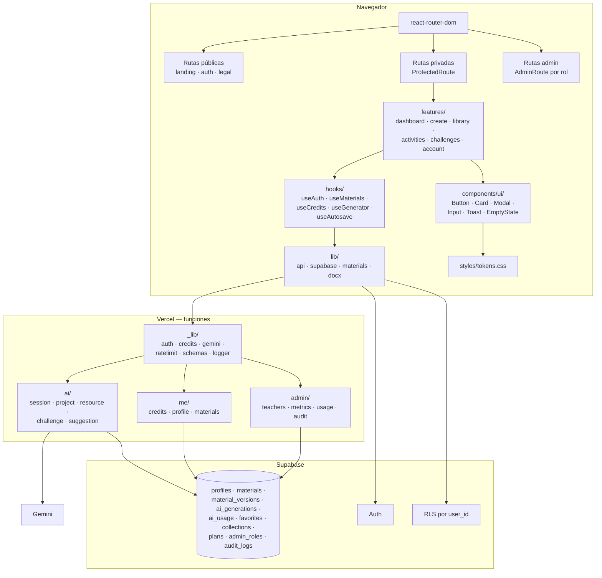

# 18 — Arquitectura objetivo V2

Principio rector: **aprovechar el stack actual.** React + Vite + Supabase + Vercel + Gemini es una combinación adecuada para este producto. **No hay reescritura.** Lo que cambia es la organización, no la tecnología.

---

## 1. Qué se conserva y qué cambia

### Se conserva

| Elemento | Por qué |
|---|---|
| **React 18 + Vite** | Rápido, simple, adecuado. Nada justifica cambiarlo |
| **Supabase** (Auth + Postgres + RLS) | Bien aprovechado; las políticas RLS son correctas |
| **Vercel** (estático + funciones) | Encaja con el patrón y el equipo |
| **Gemini con `responseSchema`** | Decisión acertada: salida estructurada, no texto libre |
| **Los prompts** | El mayor activo del producto. Se mueven, no se reescriben |
| **La generación de Word con `docx`** | Funciona bien y produce el entregable que importa |
| **Tailwind** | Se conserva, complementado con tokens CSS |
| **La identidad visual** | Colores de marca, tipografías y Kantu se mantienen |

### Se elimina

| Elemento | Por qué |
|---|---|
| **`apply-sciverse-v2.mjs` del build** | La causa raíz del riesgo estructural (`05-` §2) |
| **`src/`** | 2.100 líneas muertas |
| **`components/`** (tras rescatar `CreditsIndicator`) | 1.563 líneas muertas |
| **Los 3 ZIP y `package-fallback.json`** | 234 KB obsoletos |
| **`ADMIN_SECRET`** | Sustituido por roles reales |
| **Uno de los dos lockfiles** | Instalaciones deterministas |

### Se añade

| Elemento | Por qué |
|---|---|
| **`react-router-dom`** | URLs reales (`17-` I1) |
| **ESLint + Prettier** | Evita que la deuda se regenere |
| **Vitest + Testing Library + Playwright** | Flujos P0 protegidos (estrategia en `20-IMPLEMENTATION-ROADMAP.md`, FASE 11) |
| **`vercel.json`** | Cabeceras de seguridad y rewrites de SPA |
| **`.gitattributes`** | Fin de la divergencia CRLF/LF |
| **Tokens CSS en `:root`** | Sistema de diseño (`04-`) |

### Deliberadamente NO se añade

| Tecnología | Por qué no |
|---|---|
| **Next.js** | Los beneficios reales ya están cubiertos. Migrar mientras hay P0 abiertos es riesgo sin retorno (`17-` NR2) |
| **TypeScript (ahora)** | Migrar 8.900 líneas sin pruebas y con un build que reescribe el código multiplica el riesgo. Reconsiderar tras las fases 1-2 (`17-` NR3) |
| **Redux / Zustand** | Router + hooks por dominio + estado local cubre las necesidades reales |
| **Un framework de UI (MUI, Chakra)** | Destruiría la identidad visual existente, que tiene valor |
| **ORM (Prisma, Drizzle)** | El cliente de Supabase con RLS es más simple y seguro para este caso |
| **Monorepo** | Un solo producto, un solo despliegue |

---

## 2. Arquitectura objetivo



---

## 3. Árbol de carpetas propuesto

> **PROPUESTO — esta estructura no existe todavía.** Es un **movimiento** de código, no una reescritura: la lógica de generación de Word, los prompts y los algoritmos se trasladan tal cual.

```
pruebatt/
├── index.html
├── vite.config.js
├── vercel.json                    ← NUEVO: cabeceras + rewrites SPA
├── tailwind.config.js
├── postcss.config.js
├── .gitattributes                 ← NUEVO: * text=auto eol=lf
├── .eslintrc.json                 ← NUEVO
├── .prettierrc                    ← NUEVO
├── package.json                   ← "build": "vite build" (sin codemod)
├── package-lock.json              ← UNO SOLO
│
├── public/
│   ├── favicon.svg                ← NUEVO
│   ├── og-image.png               ← NUEVO
│   ├── robots.txt                 ← NUEVO
│   └── mascot/
│       ├── kantu-material.webp    ← 891 KB → ~25 KB
│       └── kantu-session.webp     ← 875 KB → ~25 KB
│
├── api/
│   ├── _lib/                      ← NUEVO: la capa que hoy se repite 5 veces
│   │   ├── auth.js                ← requireUser · getSupabaseConfig · verificación JWT local
│   │   ├── credits.js             ← withCredit(handler): consume · ejecuta · devuelve
│   │   ├── gemini.js              ← modelo único · timeout · reintento · registro de tokens
│   │   ├── prompts/               ← prompts VERSIONADOS (movidos, no reescritos)
│   │   │   ├── system.js
│   │   │   ├── session.js         ← desde api/generate-session.js
│   │   │   ├── project.js · resource.js · challenge.js
│   │   │   └── didactic-processes.js  ← DIDACTIC_PROCESSES intacto
│   │   ├── schemas/               ← responseSchema de Gemini + validación de entrada
│   │   ├── validators/            ← NUEVO: minutos · procesos · cantidades
│   │   ├── ratelimit.js · logger.js · errors.js
│   │
│   ├── ai/
│   │   ├── session.js             ← ⭐ orquesta los 4 módulos EN SERVIDOR · 1 crédito
│   │   ├── project.js             ← versionado (hoy solo existe tras el build)
│   │   ├── resource.js            ← unifica session-resource + linked-worksheet
│   │   ├── challenge.js
│   │   └── suggestion.js
│   │
│   ├── me/
│   │   ├── credits.js · profile.js · materials.js · export.js
│   │
│   └── admin/
│       ├── _guard.js              ← requireAdminRole([...])
│       ├── me.js · teachers.js · teacher/[id].js
│       ├── metrics.js · ai-usage.js · errors.js · settings.js · audit.js
│
├── src/                           ← ⚠️ NUEVO src/, tras BORRAR el actual
│   ├── main.jsx
│   ├── App.jsx                    ← solo router y providers (~80 líneas)
│   │
│   ├── config/
│   │   ├── theme.js               ← paleta ÚNICA (hoy hay 3)
│   │   ├── cneb.js                ← CNEB · GENERATOR_AREAS · GENERATOR_CAPACITIES
│   │   ├── plans.js               ← fuente única de precios (hoy hay 4 versiones)
│   │   └── material-types.js      ← diccionario compartido catálogo ↔ biblioteca
│   │
│   ├── data/
│   │   ├── activities.js          ← desde steamGuideActivities.js
│   │   ├── challenges.js · templates.js · testimonials.js
│   │
│   ├── lib/
│   │   ├── supabase.js
│   │   ├── api.js                 ← cliente único: token · errores en español · reintentos
│   │   ├── materials.js           ← guardar · listar · duplicar · eliminar
│   │   ├── storage.js             ← localStorage tipado (autoguardado)
│   │   └── docx/                  ← MOVIDO tal cual desde App.jsx:96-291
│   │       ├── primitives.js      ← unifica word* y rubric*
│   │       ├── session.js · rubric.js · checklist.js · activity.js
│   │
│   ├── hooks/
│   │   ├── useAuth.js
│   │   ├── useProfile.js          ← lee y escribe profiles (resuelve la divergencia)
│   │   ├── useMaterials.js        ← reemplaza el bus de eventos con window
│   │   ├── useCredits.js          ← conecta /api/me/credits
│   │   ├── useGenerator.js        ← ⭐ elimina la duplicación de los 9 generadores
│   │   ├── useAutosave.js · useFavorites.js · useToast.js
│   │
│   ├── components/
│   │   ├── ui/                    ← Button · Input · Select · Card · Badge · Alert
│   │   │                            Modal(Escape+foco) · Tabs · Tooltip · Toast
│   │   │                            Skeleton · EmptyState · ErrorBoundary
│   │   ├── layout/                ← AppShell · Sidebar · Topbar · MobileNav
│   │   └── shared/                ← WizardStep · GenerationProgress · MaterialCard
│   │                                CreditsIndicator (RESCATADO de components/)
│   │
│   ├── features/
│   │   ├── auth/                  ← desde AuthGate.jsx
│   │   │   ├── AuthLayout.jsx · Register.jsx · Login.jsx
│   │   │   ├── Recovery.jsx · NewPassword.jsx
│   │   │   └── Confirmation.jsx   ← + reenvío (17- N2)
│   │   ├── onboarding/            ← NUEVO (17- N5)
│   │   ├── landing/               ← desde ImprovedLanding + secciones nuevas (11-)
│   │   ├── dashboard/             ← home docente con "continuar" (12- §6)
│   │   ├── activities/ · challenges/
│   │   ├── create/
│   │   │   ├── CreateStudio.jsx
│   │   │   └── generators/        ← un archivo por generador, todos sobre useGenerator
│   │   ├── library/               ← + colecciones + papelera
│   │   ├── material/              ← ⭐ NUEVO: visor EDITABLE (17- N1)
│   │   ├── account/ · admin/      ← lazy-loaded
│   │
│   ├── routes/
│   │   ├── index.jsx · ProtectedRoute.jsx · AdminRoute.jsx
│   │
│   └── styles/
│       ├── tokens.css             ← ⭐ :root con TODOS los tokens (04-)
│       ├── base.css · print.css   ← una sola definición de @media print
│
├── supabase/
│   └── migrations/                ← NUEVO: numeradas y reejecutables
│       ├── 001_baseline.sql       ← consolida los 4 SQL actuales + arregla el CHECK
│       ├── 002_material_types.sql · 003_plans.sql
│       ├── 004_profiles.sql · 005_ai_generations.sql
│       ├── 006_favorites.sql · 007_collections.sql
│       └── 008_admin_roles.sql
│
├── tests/
│   ├── unit/ · component/ · e2e/
│
└── docs/
    ├── audit/                     ← esta auditoría
    ├── legacy/                    ← apply-sciverse-v2.mjs y los .txt, archivados
    └── ARCHITECTURE.md · CONTRIBUTING.md
```

---

## 4. Las cinco decisiones que más cambian

### 4.1 El repositorio vuelve a ser la verdad

**Hoy:** `build` = `node apply-sciverse-v2.mjs && vite build`. El código desplegado no es el que se lee.

**V2:** `build` = `vite build`.

**Cómo:** aplicar el codemod una última vez sobre el blob de Git (LF), commitear el resultado como el nuevo `App.jsx` e `index.css`, commitear `api/generate-project-steam.js`, archivar el script.

**Es el primer trabajo del roadmap.** Sin esto, nada más es seguro.

---

### 4.2 `useGenerator` elimina la duplicación de nueve generadores

**Hoy:** nueve componentes repiten `form/step/loading/error/result` y el bloque de obtención de token aparece en cinco sitios. Cuando se añadió el progreso por módulos, solo `SteamGenerator` lo recibió.

**V2:**

```js
// src/hooks/useGenerator.js — PROPUESTO
export function useGenerator({ endpoint, buildBody, materialType, autosaveKey }) {
  // estados compartidos + token + errores en español + autoguardado
  // + progreso + guardado VISIBLE con reintento + AbortController
  return { form, setForm, step, next, back, generate, cancel, retry,
           loading, progress, error, result, saveState };
}
```

Los nueve generadores pasan a ser formulario + presentación del resultado. **Cada mejora los alcanza a todos a la vez.**

---

### 4.3 La orquestación de la IA se mueve al servidor

**Hoy:** el cliente hace 4 llamadas secuenciales a `/api/generate-session`, con 4 verificaciones redundantes de token y **sin consumir créditos**. Si falla la tercera, se pierde todo.

**V2:** `api/ai/session.js` orquesta los 4 módulos.

| Problema | Cómo se resuelve |
|---|---|
| 4 llamadas sin cuota | **1 crédito por sesión**, cobrado en el servidor |
| 4 verificaciones de token | 1 verificación local del JWT |
| Un fallo destruye todo | Reintento solo del módulo fallido |
| Resultado perdido si se cierra la pestaña | Guardado desde el servidor |
| Coste real desconocido | Registro en `ai_generations` con tokens y duración |

---

### 4.4 Un solo origen para el perfil

**Hoy:** `AuthGate.jsx:46` lee el perfil de `user_metadata`; `TeacherAccountModal` escribe solo ahí; el admin lee de `docentes`. Divergen desde la primera edición.

**V2:** `profiles` es la fuente de verdad. `useProfile` lee de la tabla y escribe en ambos destinos (la metadata queda como caché en el JWT). El admin ve lo mismo que la docente.

---

### 4.5 Tokens de diseño y componentes de UI

**Hoy:** 3 paletas divergentes, 331 colores literales, 24 radios, 58 sombras, 25+ breakpoints, 157 reglas con texto ≤10 px, 0 modales accesibles.

**V2:** `styles/tokens.css` con `:root`, `components/ui/` con ~15 componentes, y el `Modal` base resuelve la accesibilidad de los cinco modales de una vez.

---

## 5. Ruta de migración

**Sin big bang.** Cada paso es desplegable y verificable.

| Paso | Acción | Riesgo | Verificación |
|---|---|---|---|
| **1** | Eliminar el codemod: aplicar, commitear, `build` = `vite build`. Añadir `.gitattributes` | Medio | El despliegue produce el mismo sitio |
| **2** | Añadir ESLint + Prettier. **Formateo en un commit aislado** | Bajo | El linter pasa; sin cambios funcionales |
| **3** | Borrar `src/`, `components/` (tras rescatar `CreditsIndicator`), ZIP, `.txt`, `AnimalCellLab`, código muerto de `App.jsx` | Bajo | La app funciona igual con ~4.000 líneas menos |
| **4** | Extraer `config/`, `data/`, `lib/docx/` — **movimiento puro** | Bajo | Sin cambios de comportamiento |
| **5** | Añadir `tokens.css` y `components/ui/` sin migrar nada aún | Bajo | Sin cambios visuales |
| **6** | Introducir el router; mover secciones a `features/` una por una | Medio | Cada ruta funciona; añadir `vercel.json` |
| **7** | `hooks/`; migrar generadores a `useGenerator` uno a uno | Medio | Cada generador se verifica por separado |
| **8** | `api/_lib/`; migrar endpoints uno a uno | Medio | Cada endpoint se verifica por separado |
| **9** | `api/ai/session.js` con orquestación en servidor | **Alto** | Convivencia temporal con el flujo antiguo |
| **10** | Migraciones de base de datos numeradas | Medio | Probar en staging antes |
| **11** | Aplicar el sistema de diseño pantalla por pantalla | Medio | Revisión visual por pantalla |
| **12** | Admin V2 con roles; retirar `ADMIN_SECRET` | Medio | Coordinar con quien lo use |

**Los pasos 1-4 son casi sin riesgo y desbloquean todo lo demás.**

---

## 6. Comparativa

| Aspecto | Hoy | V2 |
|---|---|---|
| Fuente de verdad del código | El build lo reescribe | El repositorio |
| Archivo mayor | 3.776 líneas | < 300 líneas |
| Líneas muertas | ~4.000 (45 %) | ~0 |
| Enrutamiento | `useState` | URLs reales |
| Paletas de color | 3 divergentes | 1 |
| Duplicación de generadores | 9 copias | 1 hook |
| Auth en el backend | 5 copias | 1 módulo |
| Créditos en la ruta principal | ❌ | ✅ 1 por sesión |
| Fallo de módulo | Se pierde todo | Reintento parcial |
| Guardado | Silencioso | Visible con reintento |
| Origen del perfil | 2 sin sincronizar | 1 |
| Editar materiales | ❌ | ✅ con versiones |
| Modales accesibles | 0 de 5 | 5 de 5 |
| Texto ≤10 px | 157 reglas | 0 |
| Peso de imágenes | 1,77 MB | < 60 KB |
| División de código | Ninguna | Por ruta y generador |
| Pruebas | 0 | Flujos P0 cubiertos |
| Admin | Secreto en URL | Roles con auditoría |
| Migraciones | 4 SQL contradictorios | Numeradas y consistentes |

---

## 7. Lo que esta arquitectura NO resuelve

Honestidad sobre los límites:

- **No mejora la calidad pedagógica del output.** Eso depende de los prompts, que se conservan intactos. La mejora vendrá de poder **medir** qué versión funciona mejor (`ai_generations.prompt_version`), no de la arquitectura.
- **No reduce el coste por generación.** Solo permite **controlarlo y medirlo**. Reducirlo exige decisiones de producto: qué modelo, cuántos tokens, qué se cobra.
- **No resuelve la adquisición de usuarios.** La landing V2 ayuda, pero el crecimiento es un problema comercial.
- **No sustituye tener un entorno de desarrollo local funcionando.** Es un requisito previo, no un resultado.

---

## 8. Estimación

| Fase | Contenido | Duración |
|---|---|---|
| Pasos 1-4 | Base: sin codemod, con tooling, sin código muerto | 1 semana |
| Pasos 5-7 | Frontend: tokens, router, hooks | 3 semanas |
| Paso 8-9 | Backend: `_lib` y orquestación en servidor | 2 semanas |
| Paso 10 | Base de datos | 1,5 semanas |
| Paso 11 | Sistema de diseño aplicado | 2 semanas |
| Paso 12 | Admin V2 | 1,5 semanas |
| **Total** | | **~11 semanas** |

Con un desarrollador a tiempo completo, y **desplegando a producción a lo largo de todo el proceso**, no al final.

El detalle por fases, con criterios de aceptación y pruebas requeridas, está en `20-IMPLEMENTATION-ROADMAP.md`.
