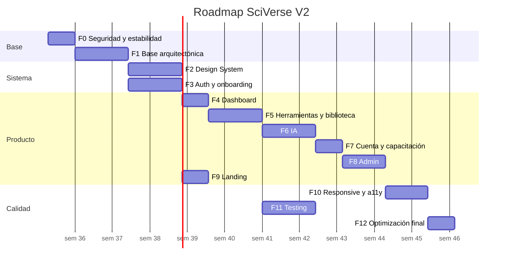

# 20 — Roadmap de implementación

Trece fases. Cada una es desplegable y verificable por separado. **Nada de big bang.**

Los identificadores `B-xxx` remiten a `19-IMPROVEMENT-BACKLOG.md`.

---

## Vista general

---

## FASE 0 — Seguridad y estabilidad

**Duración:** 1 semana · **Riesgo:** Bajo

### Objetivo

Cerrar la exposición de datos, detener la fuga de costes de IA y reparar las funciones rotas. **Sin tocar la arquitectura.**

### Tareas

| # | Tarea | ID | Esfuerzo |
|---|---|---|---|
| 0.1 | Límite de presupuesto y alertas en Google Cloud | B-009 | XS |
| 0.2 | Fijar modelo de Gemini válido; documentar `GEMINI_MAIN_MODEL` | B-008 | XS |
| 0.3 | `ADMIN_SECRET` a cabecera + `timingSafeEqual` + **rotar el secreto** | B-005 | XS |
| 0.4 | Paginar `list-docentes` y limitar columnas | B-006 | XS |
| 0.5 | Limitación de intentos en `list-docentes` | B-007 | S |
| 0.6 | `vercel.json` con cabeceras de seguridad | B-018 | XS |
| 0.7 | Migración `001_baseline.sql` con `challenge` incluido | B-003, B-004 | S |
| 0.8 | Guardado visible con reintento | B-011 | S |
| 0.9 | Importar `CreditsIndicator` | B-012 | XS |
| 0.10 | Optimizar PNG de Kantu a WebP | B-013 | XS |
| 0.11 | Quitar `contenido` del listado de biblioteca | B-029 | XS |
| 0.12 | Regla `:focus-visible` global | B-020 | XS |
| 0.13 | Arreglar `onChoosePlan` | B-017 | XS |
| 0.14 | Unificar precios en una fuente única | B-016 | S |
| 0.15 | Retirar "Crucigrama" del catálogo | B-014 | S |
| 0.16 | Eliminar un lockfile; fijar `packageManager` | B-019 | XS |
| 0.17 | Actualizar `.env.example` | — | XS |

### Archivos afectados

`api/list-docentes.js` · `AdminPanel.jsx` · `api/generate-session.js` · `api/generate-session-resource.js` · `api/generate-linked-worksheet.js` · `App.jsx` · `index.css` · `index.html` · `public/mascot/` · `.env.example` · `package.json` · `vercel.json` **(PROPUESTO)** · `supabase/migrations/001_baseline.sql` **(PROPUESTO)**

### Dependencias

Ninguna. **Todo se puede hacer sobre el código actual.**

> ⚠️ Como el codemod sigue activo, cada edición de `App.jsx` debe verificar que **no toca ninguna de las 9 anclas** de `apply-sciverse-v2.mjs`. Comprobación obligatoria antes de desplegar: ejecutar el codemod sobre una copia con finales de línea LF.

### Riesgo

**Bajo**, con dos excepciones:

- **0.7** modifica la base de datos → ejecutar primero en staging.
- **0.15** cambia el catálogo visible → comunicar el motivo si algún docente lo usaba.

### Criterio de aceptación

- [ ] El listado de docentes ya no acepta el secreto por URL, y el antiguo está rotado
- [ ] La respuesta de `list-docentes` está paginada y no incluye `celular`
- [ ] Existe un límite de gasto activo en Google Cloud
- [ ] Un reto grupal generado **aparece en la biblioteca**
- [ ] Un fallo de guardado muestra un aviso con "Reintentar"
- [ ] El saldo de créditos es visible en la interfaz
- [ ] La suma de imágenes descargadas es < 100 KB
- [ ] El foco de teclado es visible en todos los botones
- [ ] "Elegir plan mensual" abre WhatsApp, no el registro
- [ ] El mismo límite semanal aparece igual en landing, dashboard y Mi cuenta
- [ ] "Crucigrama" ya no está en el catálogo

### Testing requerido

Manual, sin infraestructura de pruebas todavía:

1. Registro → confirmación → login → generar sesión → guardar → descargar
2. Generar reto → **verificar que aparece en la biblioteca**
3. Panel admin con el nuevo secreto por cabecera
4. Medir el peso de la página con las herramientas del navegador
5. Recorrer toda la aplicación **solo con teclado**

---

## FASE 1 — Base arquitectónica

**Duración:** 2 semanas · **Riesgo:** Medio

### Objetivo

Que el repositorio vuelva a ser la fuente de verdad y que exista un entorno de desarrollo funcional. **Es la fase que desbloquea todas las demás.**

### Tareas

| # | Tarea | ID | Esfuerzo |
|---|---|---|---|
| 1.1 | Ejecutar el codemod una última vez y **commitear el resultado** | B-001 | S |
| 1.2 | `"build": "vite build"`; archivar `apply-sciverse-v2.mjs` en `docs/legacy/` | B-001 | XS |
| 1.3 | Commitear `api/generate-project-steam.js` | B-001 | XS |
| 1.4 | Añadir `.gitattributes` con `* text=auto eol=lf` | B-002 | XS |
| 1.5 | **Verificar que `npm install && npm run build` funciona en local** | — | S |
| 1.6 | ESLint + Prettier; **formateo en un commit aislado** | B-026 | S |
| 1.7 | Eliminar `src/`; corregir `tailwind.config.js` | B-021, B-130 | XS |
| 1.8 | Rescatar `CreditsIndicator`; eliminar el resto de `components/` | B-022 | S |
| 1.9 | Eliminar código muerto de `App.jsx` (~650 líneas) | B-023, B-024 | S |
| 1.10 | Eliminar ZIP, `.txt`, `package-fallback.json`, `AnimalCellLab.jsx` | B-025 | XS |
| 1.11 | Extraer `config/`, `data/`, `lib/docx/` — **movimiento puro** | B-047 | M |
| 1.12 | Introducir `react-router-dom` con rutas explícitas | B-046 | M |
| 1.13 | Mover secciones a `features/` una por una | B-047 | L |
| 1.14 | `ErrorBoundary` en raíz y por sección | B-050 | S |
| 1.15 | Crear proyecto Supabase de staging | B-027 | S |
| 1.16 | CI en GitHub Actions: lint + build | B-097 | S |

### Archivos afectados

Prácticamente todos. Es la fase de mayor movimiento de código — pero **movimiento, no reescritura**.

### Dependencias

Fase 0 completa (para no arrastrar problemas de seguridad a la reestructuración).

### Riesgo

**Medio-alto en 1.1 y 1.13.**

Mitigación:

- **1.1**: comparar el `App.jsx` resultante con el que produce el build actual — deben ser idénticos. Desplegar a una rama de vista previa de Vercel y comparar visualmente antes de fusionar.
- **1.6**: el formateo va en un commit **exclusivo**, sin ningún cambio funcional, para que el diff sea revisable.
- **1.13**: una sección por commit, con despliegue de vista previa en cada una.

### Criterio de aceptación

- [ ] `npm run build` funciona en local en Windows y en Linux
- [ ] `npm run build` es **reejecutable** sin fallar
- [ ] El sitio desplegado es **visualmente idéntico** al anterior
- [ ] `npm run lint` pasa sin errores
- [ ] El repositorio tiene ~4.000 líneas menos
- [ ] Cada sección tiene su URL y el botón Atrás funciona
- [ ] Recargar en `/biblioteca` mantiene la sección
- [ ] Un error de render muestra una pantalla de recuperación, no un blanco
- [ ] Existe un entorno de staging conectado a un Supabase propio

### Testing requerido

- Comparación visual pantalla por pantalla, antes y después
- Recorrido completo del flujo P0 en la vista previa
- Verificar que todas las URLs nuevas cargan directamente (rewrites de SPA)

---

## FASE 2 — Design System

**Duración:** 2 semanas · **Riesgo:** Medio

### Objetivo

Sistematizar la identidad visual existente. **Se conservan los colores de marca, las tipografías y Kantu.**

### Tareas

| # | Tarea | ID | Esfuerzo |
|---|---|---|---|
| 2.1 | `styles/tokens.css` con `:root` completo | B-082, B-083 | S |
| 2.2 | Unificar las 3 paletas en `config/theme.js` | B-049 | S |
| 2.3 | Eliminar los alias engañosos (`violet`, `amber`, `cyan`) | B-121 | S |
| 2.4 | **Aplicar la escala tipográfica** (157 reglas ≤10 px → mínimo 12 px) | B-082 | M |
| 2.5 | Aplicar la paleta de neutrales con contraste ≥4.5:1 | B-083 | M |
| 2.6 | Normalizar radios (24→5) y sombras (58→5) | B-116 | S |
| 2.7 | Extraer `components/ui/`: Button, Input, Card, Badge, Alert, Tabs | B-117 | L |
| 2.8 | `Modal` base con Escape, trampa y devolución de foco | B-084 | M |
| 2.9 | `Toast` y `ConfirmDialog`; retirar `alert`/`confirm` | B-118 | S |
| 2.10 | `EmptyState` y `Skeleton` | B-119, B-120 | S |
| 2.11 | Eliminar el `@import` de fuentes duplicado | B-028 | XS |
| 2.12 | Unificar `@media print` en `styles/print.css` | — | XS |

### Riesgo

**Medio.** La tarea 2.4 cambia visualmente **todas** las pantallas: el texto crece y la densidad debe reajustarse.

Mitigación: aplicar pantalla por pantalla con revisión visual, empezando por las menos críticas (plantillas, capacitación) y terminando por dashboard y generadores.

### Criterio de aceptación

- [ ] **Ninguna regla CSS fija texto por debajo de 12 px**
- [ ] Todo el texto alcanza 4.5:1 de contraste (verificado con axe)
- [ ] Un solo bloque `:root` concentra los tokens; sin colores literales nuevos
- [ ] Los 5 modales cierran con `Escape` y devuelven el foco
- [ ] Sin `window.alert` ni `window.confirm` en el código
- [ ] El login y la aplicación usan el **mismo** tono de teal
- [ ] Lighthouse Accessibility ≥ 90

---

## FASE 3 — Auth y onboarding

**Duración:** 2 semanas · **Riesgo:** Alto

### Objetivo

Reparar el registro y llevar a la docente a su primer material en menos de 5 minutos.

### Tareas

| # | Tarea | ID | Esfuerzo |
|---|---|---|---|
| 3.1 | Migración `004_profiles.sql`: PK `user_id`, grados, áreas, región, onboarding | B-044 | M |
| 3.2 | `useProfile`: leer de la tabla, escribir en tabla + metadata | B-015 | M |
| 3.3 | Comprobar `activo` al iniciar sesión y en la API | B-037 | S |
| 3.4 | **Reenvío del correo de confirmación** con cuenta atrás y aviso de spam | B-054 | S |
| 3.5 | Registro en 2 pasos con progreso visible | — | M |
| 3.6 | Enlazar términos y privacidad desde el registro | B-075 | XS |
| 3.7 | Mostrar/ocultar contraseña y medidor de fortaleza | — | S |
| 3.8 | Captcha en el registro | B-036 | S |
| 3.9 | **Onboarding de 3 pantallas** | B-058 | L |
| 3.10 | Precargar los formularios desde el perfil | B-059 | M |
| 3.11 | Autoguardado de formularios | B-055 | S |
| 3.12 | Eliminar cuenta y exportar datos | B-065 | M |

### Riesgo

**Alto.** Se toca autenticación y perfil, con usuarios reales en producción.

Mitigación:

- 3.1 y 3.2 con **vista de compatibilidad** `docentes` para no romper el admin.
- Escritura dual (tabla + metadata) durante dos semanas antes de cambiar la lectura.
- Probar con cuentas reales existentes en staging antes de producción.

### Criterio de aceptación

- [ ] Editar el perfil se refleja **inmediatamente** en la interfaz y en la base de datos
- [ ] El panel admin muestra el nombre actualizado
- [ ] Se puede reenviar el correo de confirmación
- [ ] Una cuenta con `activo = false` **no puede iniciar sesión**
- [ ] Los formularios de generación llegan precargados con nivel, grado y área
- [ ] Recargar durante un asistente ofrece recuperar lo escrito
- [ ] Una docente nueva descarga su primer Word en menos de 5 minutos
- [ ] Se puede eliminar la cuenta y descargar los datos

### Testing requerido

- E2E de registro → confirmación → onboarding → primera generación
- Verificar con cuentas creadas **antes** de la migración
- Prueba de reversión de la migración en staging

---

## FASE 4 — Dashboard

**Duración:** 1 semana · **Riesgo:** Bajo

### Objetivo

Convertir el dashboard en el centro de trabajo.

### Tareas

| # | Tarea | ID | Esfuerzo |
|---|---|---|---|
| 4.1 | **"Continuar donde lo dejaste"** | B-057 | M |
| 4.2 | Materiales recientes con descarga directa | B-057 | S |
| 4.3 | Cuatro estadísticas reales | B-152 | S |
| 4.4 | Créditos y plan reales en la barra lateral | B-153 | XS |
| 4.5 | Una acción principal diferenciada del resto | — | S |
| 4.6 | Resolver o retirar "Pregúntale a Kantu" | — | S |
| 4.7 | Sección de novedades y capacitación | — | S |

### Criterio de aceptación

- [ ] El dashboard muestra el último material con acciones directas
- [ ] Las 4 estadísticas muestran valores **distintos** y reales
- [ ] La barra lateral muestra el plan real del perfil
- [ ] Ningún botón del dashboard lleva a un callejón sin salida
- [ ] Hay **una** acción principal visualmente dominante

---

## FASE 5 — Herramientas y biblioteca

**Duración:** 2 semanas · **Riesgo:** Medio

### Objetivo

Que la docente pueda **editar** lo que genera y encontrar su trabajo.

### Tareas

| # | Tarea | ID | Esfuerzo |
|---|---|---|---|
| 5.1 | Hook `useGenerator` unificando los 9 generadores | B-048 | M |
| 5.2 | **Edición en línea de materiales** | B-105 | L |
| 5.3 | `material_versions` e historial | B-106 | M |
| 5.4 | Diccionario único de tipos: etiquetas y filtros | B-061 | S |
| 5.5 | Enrutar la descarga al exportador Word correcto | B-062 | S |
| 5.6 | Búsqueda y paginación en servidor | B-111 | M |
| 5.7 | Colecciones | B-108 | M |
| 5.8 | Papelera de 30 días | B-109 | S |
| 5.9 | Favoritos en Supabase | B-043, B-150 | S |
| 5.10 | Vincular instrumento con su sesión (`parent_id`) | B-110 | S |
| 5.11 | Pasar el contexto del reto al crear instrumento | B-063 | S |
| 5.12 | Exponer "Guía de observación" y "Cuestionario" | B-068 | S |
| 5.13 | Añadir "Sesión" y "Clase completa" al catálogo | B-064 | XS |

### Riesgo

**Medio.** La edición (5.2) introduce escrituras sobre materiales que hoy son inmutables.

Mitigación: guardar siempre una versión antes de modificar; el historial permite revertir.

### Criterio de aceptación

- [ ] Se puede editar cualquier campo de un material y se guarda solo
- [ ] Existe historial de versiones con posibilidad de restaurar
- [ ] Los 9 tipos de material muestran su etiqueta correcta y son filtrables
- [ ] La descarga desde biblioteca tiene la **misma calidad** que la original
- [ ] La búsqueda encuentra materiales más allá de los 100 primeros
- [ ] Los favoritos se ven desde otro dispositivo
- [ ] Eliminar un material se puede deshacer

---

## FASE 6 — IA

**Duración:** 2 semanas · **Riesgo:** Alto

### Objetivo

Controlar el coste, hacer la generación robusta y registrar todo.

### Tareas

| # | Tarea | ID | Esfuerzo |
|---|---|---|---|
| 6.1 | `api/_lib/`: auth, gemini, errores, logger | B-031, B-035 | M |
| 6.2 | Limitación de tasa en todos los endpoints | B-032 | M |
| 6.3 | Validación por esquema de las entradas | B-033 | M |
| 6.4 | Timeout y reintento hacia Gemini | B-034 | S |
| 6.5 | **`api/ai/session.js`: orquestar los 4 módulos en servidor, 1 crédito** | B-098 | L |
| 6.6 | `ai_generations` y `ai_usage` | B-042 | M |
| 6.7 | Validación semántica del output | B-099 | M |
| 6.8 | Reintento por módulo sin perder progreso | B-056 | M |
| 6.9 | Progreso real con nombres pedagógicos y cancelar | B-060 | M |
| 6.10 | Delimitar la entrada del usuario en los prompts | B-038 | S |
| 6.11 | Prompts versionados | B-100 | M |
| 6.12 | Regeneración parcial por sección | B-107 | M |
| 6.13 | Que el plan ajuste `ai_weekly_limit` | B-066 | M |

### Riesgo

**Alto.** La tarea 6.5 reescribe el flujo central del producto.

Mitigación:

- Convivencia temporal: `api/ai/session.js` junto al endpoint antiguo, con un interruptor.
- Comparar resultados de ambos flujos con el mismo formulario antes de cambiar.
- Vigilar la tasa de error durante 48 h tras el cambio.

### Criterio de aceptación

- [ ] Una sesión completa consume **exactamente 1 crédito**
- [ ] Ninguna ruta de generación queda sin consumir crédito
- [ ] Un fallo en el módulo 3 permite reintentar **solo ese módulo**
- [ ] El resultado se guarda aunque se cierre la pestaña
- [ ] Cada generación queda registrada con tokens y duración
- [ ] Los minutos de inicio + desarrollo + cierre suman la duración pedida
- [ ] Un plan pagado concede más créditos automáticamente
- [ ] Se puede cancelar una generación en curso

### Testing requerido

- Comparar 10 sesiones generadas con el flujo antiguo y el nuevo
- Simular fallo de Gemini en cada módulo y verificar el reintento
- Verificar la devolución de crédito ante fallo
- Prueba de carga sobre la limitación de tasa

---

## FASE 7 — Cuenta y capacitación

**Duración:** 1 semana · **Riesgo:** Bajo

| # | Tarea | ID | Esfuerzo |
|---|---|---|---|
| 7.1 | Cambiar correo con reverificación | — | M |
| 7.2 | Uso real de créditos y descargas en Mi cuenta | B-012 | S |
| 7.3 | Implementar o retirar los referidos | B-067 | M |
| 7.4 | Calendario e inscripción a capacitaciones | B-162 | M |
| 7.5 | Retirar las integraciones "Próximamente" | B-161 | XS |
| 7.6 | Correo semanal de retorno | B-113 | M |
| 7.7 | Confirmar al cerrar sesión con trabajo sin guardar | B-151 | S |

### Criterio de aceptación

- [ ] Mi cuenta muestra el consumo **real**, no cifras fijas
- [ ] Los referidos funcionan de verdad o ya no aparecen
- [ ] No hay ninguna función anunciada como "Próximamente" sin fecha
- [ ] El correo semanal se envía y se puede dar de baja

---

## FASE 8 — Admin

**Duración:** 1,5 semanas · **Riesgo:** Medio

| # | Tarea | ID | Esfuerzo |
|---|---|---|---|
| 8.1 | `admin_roles` y `has_admin_role` | B-076 | M |
| 8.2 | Ruta `/admin` con login normal y guardia por rol | B-077 | M |
| 8.3 | Listado con búsqueda, filtros y paginación | B-077 | M |
| 8.4 | Detalle de docente con acciones | B-080 | M |
| 8.5 | Panel de consumo de IA | B-081 | M |
| 8.6 | `audit_logs` | B-079 | M |
| 8.7 | **Retirar `ADMIN_SECRET` y `?admin=1`** | B-078 | S |
| 8.8 | Configuración de planes y herramientas | B-145 | M |
| 8.9 | Panel de errores | B-144 | M |

### Riesgo

**Medio.** La tarea 8.7 elimina el único acceso administrativo actual.

Mitigación: convivencia de ambos accesos durante una semana; retirar el antiguo solo tras confirmar que el nuevo funciona para todos los administradores.

### Criterio de aceptación

- [ ] El acceso admin usa login normal con rol verificado
- [ ] `ADMIN_SECRET` ya no existe en el código ni en las variables
- [ ] Cada acceso a datos personales queda registrado con su autor
- [ ] Se puede confirmar un pago y cambiar el plan **desde el panel**
- [ ] Se puede desactivar una cuenta y la desactivación es **efectiva**
- [ ] El coste de IA por docente es consultable

---

## FASE 9 — Landing

**Duración:** 1 semana · **Riesgo:** Bajo

| # | Tarea | ID | Esfuerzo |
|---|---|---|---|
| 9.1 | Metadatos, Open Graph, canonical, favicon, `robots.txt` | B-069 | XS |
| 9.2 | Nuevo titular y sección del problema | B-071 | S |
| 9.3 | Sección "Cómo funciona" | B-072 | S |
| 9.4 | Sección de precios visible | B-070 | S |
| 9.5 | Sección de alineación al CNEB | B-073 | S |
| 9.6 | Vista previa del Word generado | B-146 | M |
| 9.7 | Demo interactiva real | B-147 | M |
| 9.8 | Sección para instituciones | B-148 | S |
| 9.9 | Resolver los testimonios | B-074 | S |
| 9.10 | Páginas legales con URL propia | B-149 | S |

### Criterio de aceptación

- [ ] Compartir el enlace por WhatsApp muestra título, descripción e imagen
- [ ] Los precios son visibles sin abrir ningún modal
- [ ] El Libro de Reclamaciones tiene URL propia y enlazable
- [ ] Lighthouse SEO ≥ 95
- [ ] Los testimonios están respaldados o etiquetados

---

## FASE 10 — Responsive y accesibilidad

**Duración:** 1,5 semanas · **Riesgo:** Medio

| # | Tarea | ID | Esfuerzo |
|---|---|---|---|
| 10.1 | Unificar a 5 puntos de ruptura con `min-width` | B-089 | M |
| 10.2 | Resolver la zona muerta de tablet | B-090 | S |
| 10.3 | Navegación móvil con acceso a cuenta | B-092 | S |
| 10.4 | Modales como hoja inferior en móvil | B-122 | M |
| 10.5 | Tabla del admin adaptada a móvil | B-091 | S |
| 10.6 | Objetivos táctiles ≥44 px | B-085 | S |
| 10.7 | `aria-label` en botones de solo icono | B-086 | S |
| 10.8 | Enlace "Saltar al contenido" | B-087 | XS |
| 10.9 | `role="alert"` en errores de generadores | B-088 | S |
| 10.10 | `aria-selected` en pestañas; un solo `<h1>` por vista | B-137, B-138 | S |
| 10.11 | `prefers-reduced-motion` completo | B-140 | S |
| 10.12 | Contenedores con `overflow-x: auto` | B-141 | S |

### Criterio de aceptación

- [ ] Lighthouse Accessibility ≥ 95 en todas las pantallas
- [ ] axe DevTools sin incidencias críticas ni graves
- [ ] Toda la aplicación es operable **solo con teclado**
- [ ] Ninguna pantalla desborda horizontalmente entre 320 y 1920 px
- [ ] Prueba con lector de pantalla superada en los flujos P0

---

## FASE 11 — Testing

**Duración:** 2 semanas · **Riesgo:** Bajo
*(Puede solaparse con las fases 5-8.)*

### Estrategia

| Nivel | Herramienta | Qué cubre |
|---|---|---|
| **Unitario** | Vitest | `lib/docx/`, validadores, `generateWordSearchGrid`, utilidades de fecha y formato |
| **Componente** | Vitest + Testing Library | Formularios de auth, generadores, `Modal`, `EmptyState` |
| **Integración** | Vitest + MSW | `lib/api.js` con respuestas simuladas: éxito, 429, 401, 500 |
| **API** | Vitest | Endpoints con Supabase y Gemini simulados: auth, cuota, validación |
| **Supabase** | SQL en staging | Políticas RLS: que un docente no vea materiales de otro |
| **Gemini** | Contrato | Que la respuesta simulada valide contra `responseSchema` |
| **E2E** | Playwright | Los 5 recorridos P0 |
| **Responsive** | Playwright | Capturas en 375 / 768 / 1280 / 1920 px |
| **Accesibilidad** | axe-playwright | Automatizado en cada ruta |

### Los cinco flujos P0 que deben tener pruebas antes de seguir desplegando

| # | Flujo | Por qué es P0 |
|---|---|---|
| **1** | Registro → confirmación → login | Si se rompe, no entran usuarios nuevos |
| **2** | Generar sesión → guardar → aparece en biblioteca | El núcleo del producto |
| **3** | Descargar Word | El entregable que da valor |
| **4** | Consumo y devolución de crédito | Fallar aquí cuesta dinero o irrita al cliente |
| **5** | Aislamiento entre docentes (RLS) | Fallar aquí es una filtración de datos |

### Tareas

| # | Tarea | ID | Esfuerzo |
|---|---|---|---|
| 11.1 | Configurar Vitest + Testing Library | B-093 | S |
| 11.2 | Pruebas unitarias de `lib/` | B-094 | M |
| 11.3 | Pruebas de componente de auth y generadores | B-095 | M |
| 11.4 | Pruebas de API con simulaciones | — | M |
| 11.5 | Pruebas de RLS en staging | — | S |
| 11.6 | E2E de los 5 flujos P0 | B-096 | L |
| 11.7 | Capturas responsive automatizadas | — | S |
| 11.8 | axe automatizado por ruta | — | S |
| 11.9 | CI completo: lint + build + test + E2E | B-097 | S |

### Criterio de aceptación

- [ ] Los 5 flujos P0 tienen E2E que pasa en CI
- [ ] Cobertura ≥ 60 % en `lib/` y `hooks/`
- [ ] CI bloquea la fusión si algo falla
- [ ] Las pruebas de RLS confirman el aislamiento entre docentes

---

## FASE 12 — Optimización final

**Duración:** 1 semana · **Riesgo:** Bajo

| # | Tarea | ID | Esfuerzo |
|---|---|---|---|
| 12.1 | División de código por ruta y generador | B-051 | M |
| 12.2 | Importación dinámica de `docx` | B-052 | S |
| 12.3 | `React.lazy` para el admin | B-129 | XS |
| 12.4 | `useMemo` en filtrados | B-124 | XS |
| 12.5 | Descentralizar el estado | B-053 | M |
| 12.6 | Caché de peticiones | B-128 | M |
| 12.7 | Reducir pesos de fuentes y `preconnect` | B-131 | XS |
| 12.8 | Índices de base de datos | B-133 | S |
| 12.9 | Instrumentar analítica | B-142 | M |
| 12.10 | Panel de métricas de producto | B-143 | L |

### Eventos de analítica a instrumentar

Sin implementar todavía; se definen aquí para que la fase tenga alcance cerrado:

`signup_started` · `signup_completed` · `email_confirmed` · `login` · `onboarding_started` · `onboarding_completed` · `tool_opened` · `generation_started` · `generation_completed` · `generation_failed` · `credit_exhausted` · `resource_saved` · `save_failed` · `material_edited` · `download` · `session_created` · `return_user` · `plan_viewed` · `plan_selected`

Cada uno con: `user_id`, `nivel`, `area`, `tipo`, `duration_ms` donde aplique.

### Criterio de aceptación

- [ ] Carga inicial de JS < 200 KB comprimido
- [ ] LCP < 2,5 s en 4G simulado
- [ ] Lighthouse Performance ≥ 85
- [ ] El embudo de registro es medible de principio a fin
- [ ] Escribir en el buscador de biblioteca no produce retardo perceptible

---

## Resumen de fases

| Fase | Nombre | Duración | Riesgo | Desbloquea |
|---|---|---|---|---|
| **0** | Seguridad y estabilidad | 1 sem | Bajo | Detiene la sangría |
| **1** | Base arquitectónica | 2 sem | **Medio-alto** | **Todo lo demás** |
| **2** | Design System | 2 sem | Medio | Fases 4-10 |
| **3** | Auth y onboarding | 2 sem | **Alto** | Fase 4 |
| **4** | Dashboard | 1 sem | Bajo | Retención |
| **5** | Herramientas y biblioteca | 2 sem | Medio | Fase 6 |
| **6** | IA | 2 sem | **Alto** | Control de costes |
| **7** | Cuenta y capacitación | 1 sem | Bajo | — |
| **8** | Admin | 1,5 sem | Medio | Operación diaria |
| **9** | Landing | 1 sem | Bajo | Adquisición |
| **10** | Responsive y accesibilidad | 1,5 sem | Medio | — |
| **11** | Testing | 2 sem | Bajo | Despliegues seguros |
| **12** | Optimización final | 1 sem | Bajo | — |

**Total: ~20 semanas** con un desarrollador a tiempo completo. Menos si las fases 2, 9 y 11 se solapan con otras.

---

## Nota sobre el orden

La secuencia no es negociable en tres puntos:

1. **Fase 0 antes que nada.** Cada día que pasa con la generación de IA sin cuota es dinero, y con el secreto en la URL es exposición.
2. **Fase 1 antes que las fases 2-12.** Mientras el build reescriba el código, ningún cambio en `App.jsx` es seguro y ninguna reestructuración es posible.
3. **Fase 11 solapada, no al final.** Las pruebas de los flujos P0 deben existir antes de la fase 6, que es la más arriesgada del roadmap.

Las fases 4, 7, 9 y 10 se pueden reordenar según prioridad comercial.
